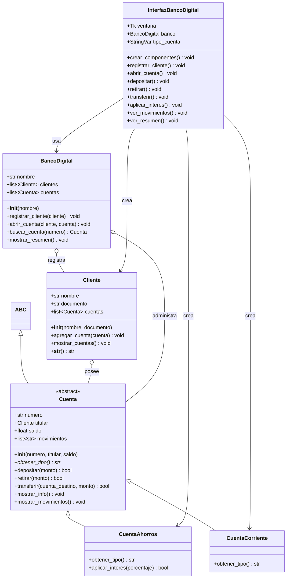
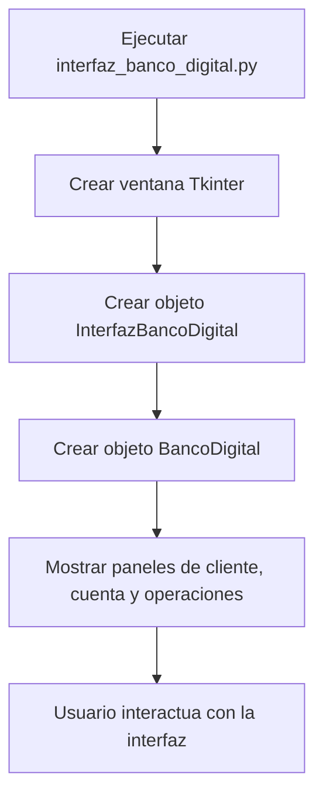
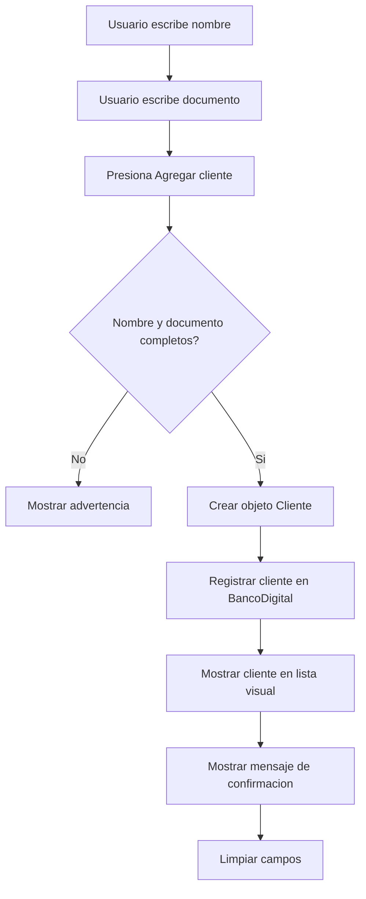
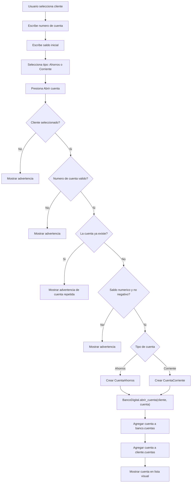
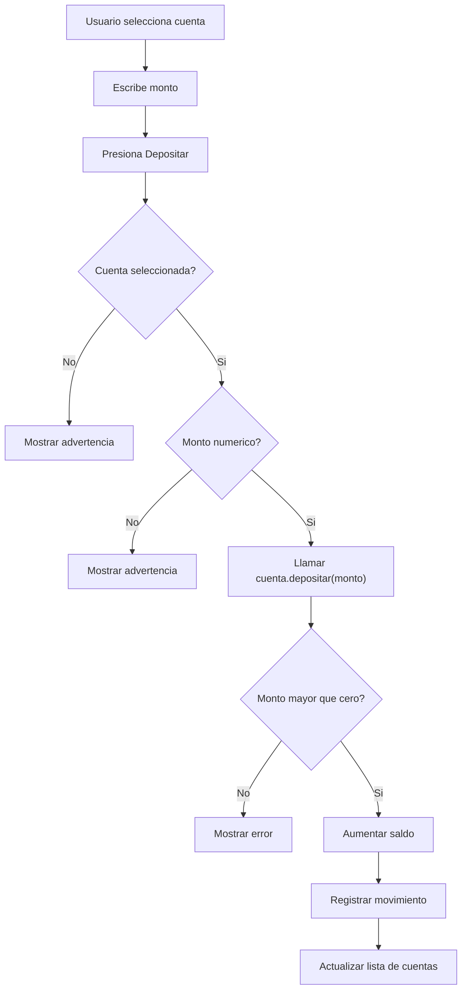
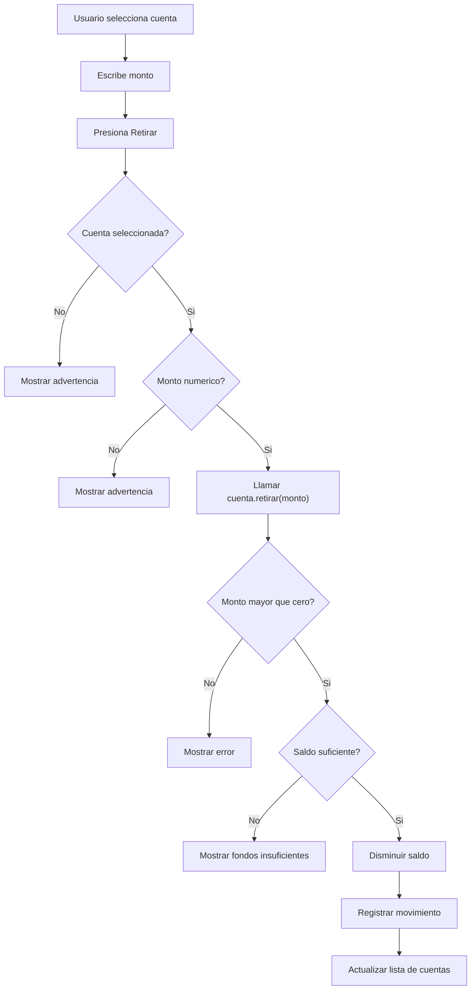
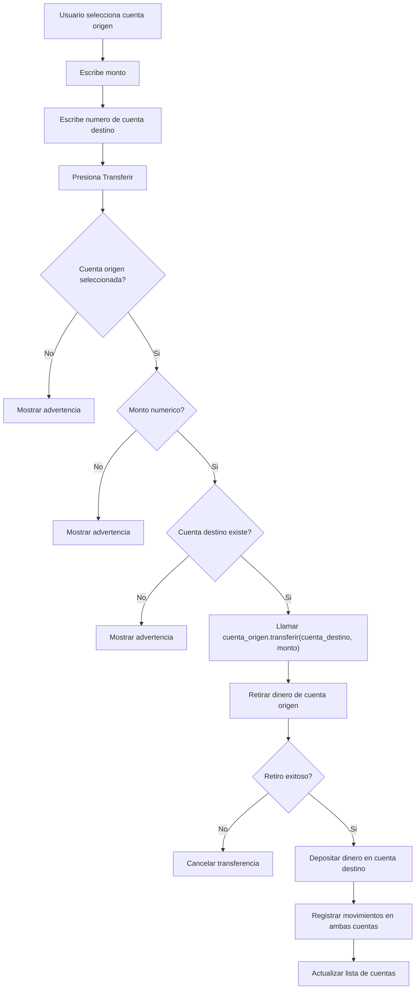
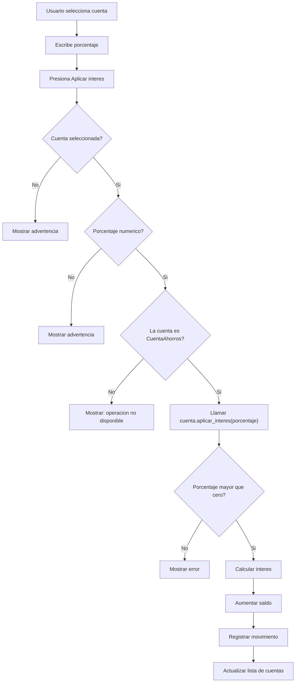
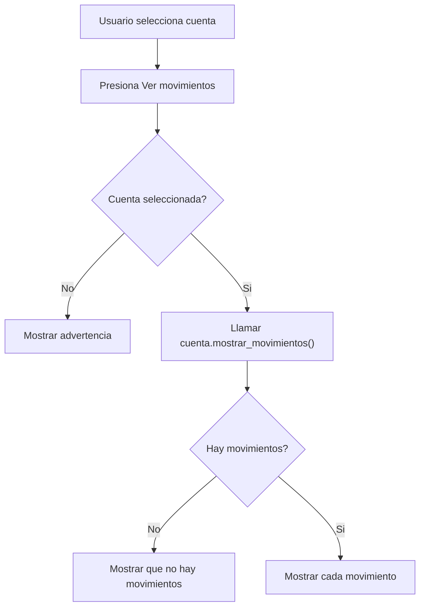
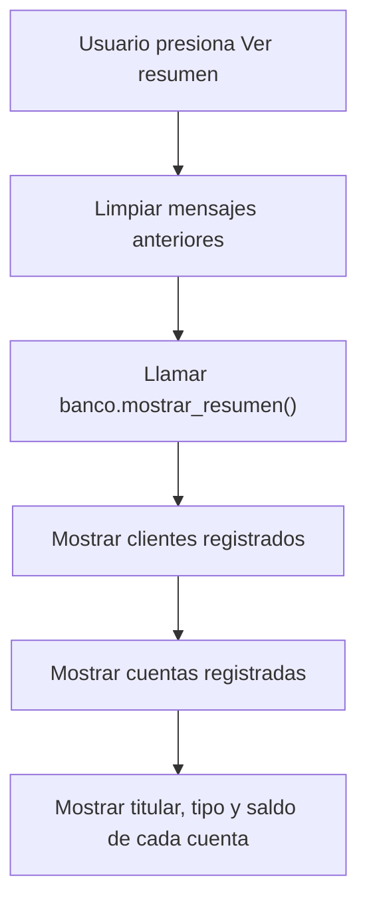

# Diagrama UML y procesos - Banco Digital

Este documento explica la estructura del programa de banco digital y los procesos principales de la interfaz grafica.

## 1. Diagrama UML de clases

### Explicacion del UML

- `Cuenta` es una clase abstracta: define la estructura comun de todas las cuentas.
- `CuentaAhorros` y `CuentaCorriente` heredan de `Cuenta`.
- `Cliente` contiene una lista de cuentas.
- `BancoDigital` administra clientes y cuentas.
- `InterfazBancoDigital` conecta la ventana grafica con las clases del banco.

## 2. Proceso general del programa

### Explicacion

La interfaz crea una instancia de `BancoDigital`. Ese objeto guarda los clientes y las cuentas creadas durante el uso del programa.

## 3. Proceso para registrar cliente

### Explicacion

La interfaz valida los campos y luego crea un objeto `Cliente`. Ese cliente se guarda en la lista `banco.clientes`.

## 4. Proceso para abrir cuenta

### Explicacion

Este proceso demuestra herencia y polimorfismo. La interfaz crea una cuenta de ahorros o corriente, pero ambas se manejan como objetos de tipo `Cuenta`.

## 5. Proceso para depositar

### Explicacion

El metodo `depositar()` pertenece a la clase `Cuenta`, por eso funciona tanto para cuentas de ahorros como para cuentas corrientes.

## 6. Proceso para retirar

### Explicacion

El retiro valida que el monto sea positivo y que la cuenta tenga saldo suficiente antes de modificar el saldo.

## 7. Proceso para transferir

### Explicacion

La transferencia reutiliza dos metodos ya existentes: `retirar()` y `depositar()`. Asi se evita duplicar logica.

## 8. Proceso para aplicar interes

### Explicacion

El interes solo existe en `CuentaAhorros`. La interfaz verifica el tipo del objeto antes de llamar ese metodo.

## 9. Proceso para ver movimientos

### Explicacion

Cada cuenta guarda su propio historial en el atributo `movimientos`. Eso es encapsulamiento: la informacion pertenece al objeto cuenta.

## 10. Proceso para ver resumen

### Explicacion

El resumen consulta el estado actual del objeto `BancoDigital`, mostrando las listas de clientes y cuentas registradas.

## 11. Conceptos POO usados

| Concepto | Donde aparece | Explicacion |
| --- | --- | --- |
| Clase | `Cliente`, `Cuenta`, `BancoDigital` | Molde para crear objetos. |
| Objeto | `Cliente(nombre, documento)` | Instancia creada desde una clase. |
| Atributo | `saldo`, `numero`, `clientes`, `cuentas` | Dato guardado dentro del objeto. |
| Metodo | `depositar()`, `retirar()`, `transferir()` | Accion que pertenece a una clase. |
| Abstraccion | `Cuenta(ABC)` | Plantilla general para cuentas bancarias. |
| Herencia | `CuentaAhorros(Cuenta)` | Una clase hija reutiliza codigo de la clase padre. |
| Polimorfismo | `obtener_tipo()` | El mismo metodo devuelve resultados diferentes segun la clase. |
| Encapsulamiento | `self.saldo`, `self.movimientos` | Los datos se guardan dentro del objeto que los maneja. |
| Composicion | `Cliente` contiene cuentas | Un objeto administra una lista de otros objetos. |
