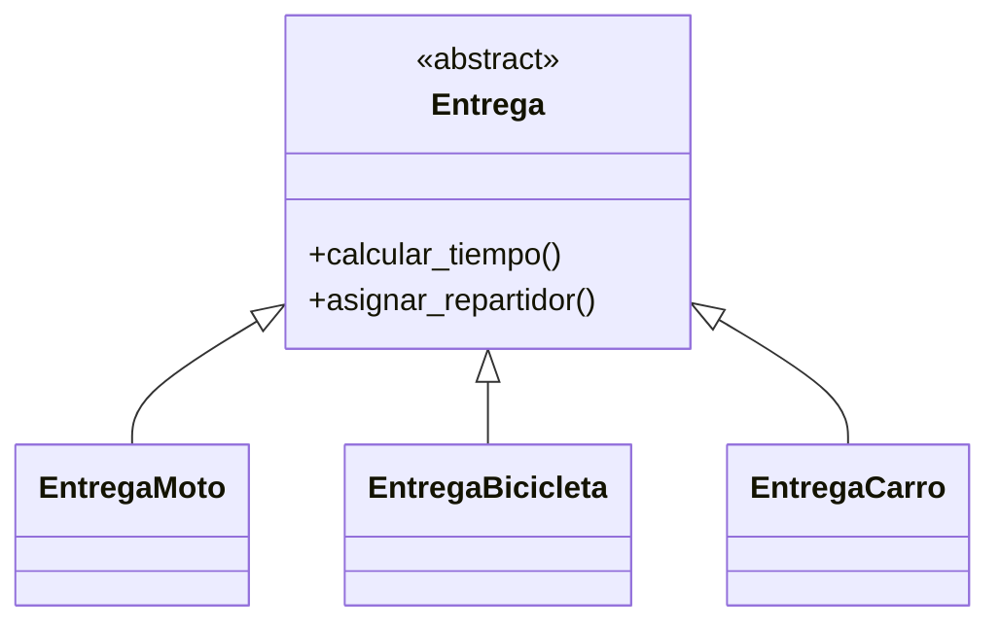
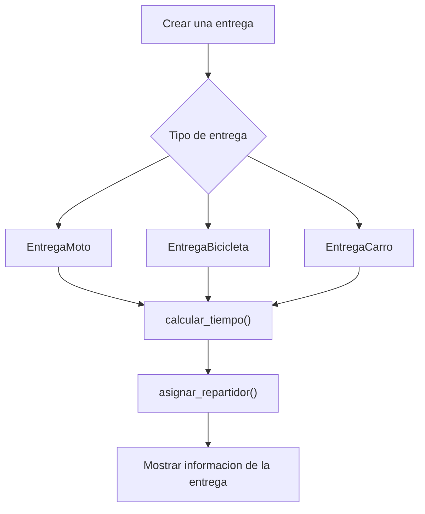

# Caso 1 - Plataforma de domicilios

## Diagrama UML

## Proceso

## Explicacion

`Entrega` es una clase abstracta. Las clases hijas representan medios de transporte diferentes y cada una puede calcular su tiempo y asignar su repartidor.
