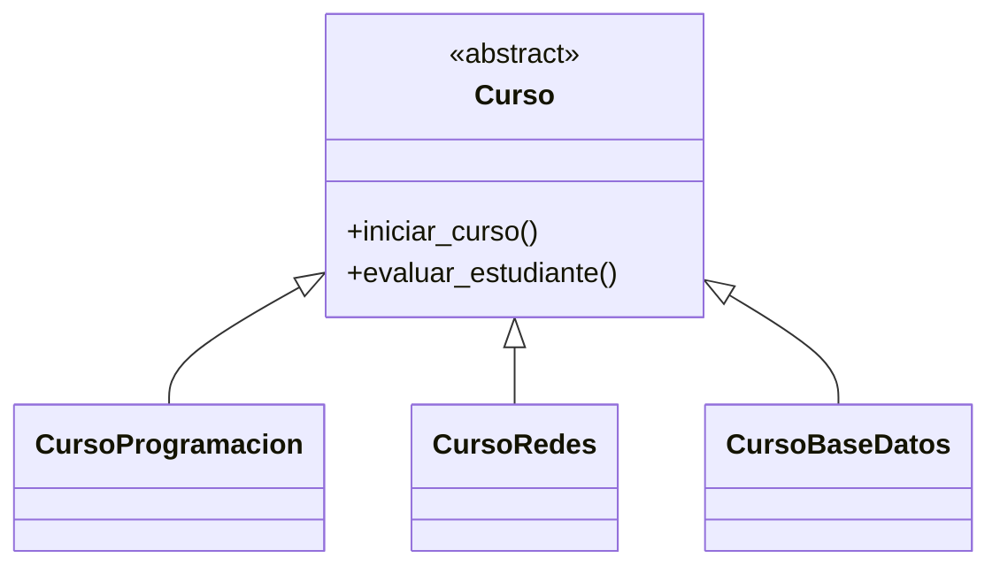
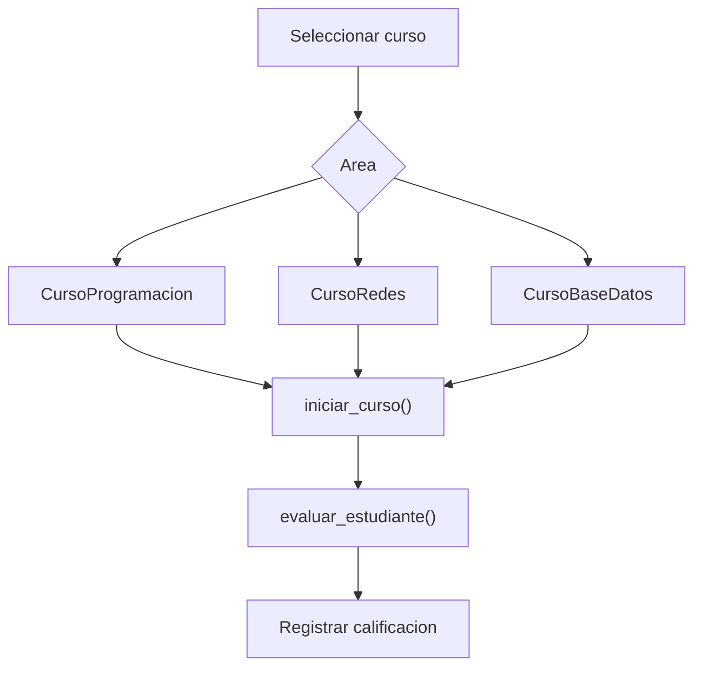

# Caso 10 - Plataforma educativa online

## Diagrama UML

```mermaid
classDiagram
    class Curso {
        <<abstract>>
        +iniciar_curso()
        +evaluar_estudiante()
    }

    class CursoProgramacion
    class CursoRedes
    class CursoBaseDatos

    Curso <|-- CursoProgramacion
    Curso <|-- CursoRedes
    Curso <|-- CursoBaseDatos
```

## Proceso

```mermaid
flowchart TD
    A["Seleccionar curso"] --> B{"Area"}
    B --> C["CursoProgramacion"]
    B --> D["CursoRedes"]
    B --> E["CursoBaseDatos"]
    C --> F["iniciar_curso()"]
    D --> F
    E --> F
    F --> G["evaluar_estudiante()"]
    G --> H["Registrar calificacion"]
```

## Explicacion

`Curso` representa cualquier curso online. Las clases hijas adaptan inicio y evaluacion al area academica.
