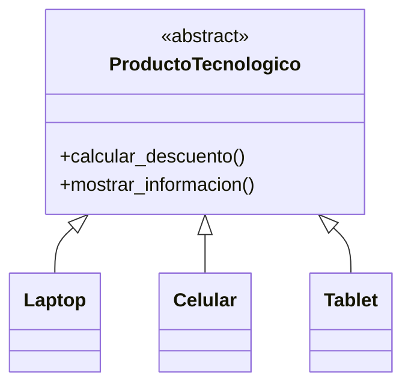
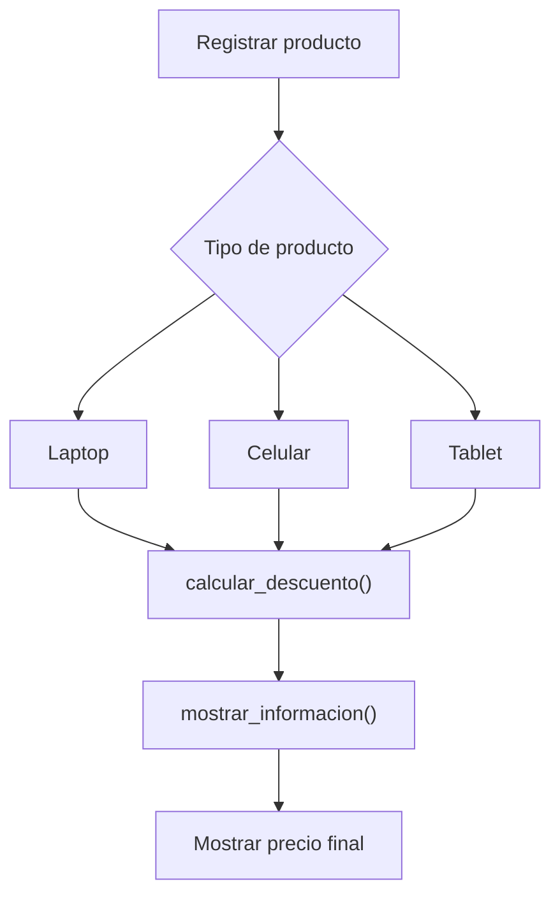

# Caso 11 - Tienda de tecnologia

## Diagrama UML

```mermaid
classDiagram
    class ProductoTecnologico {
        <<abstract>>
        +calcular_descuento()
        +mostrar_informacion()
    }

    class Laptop
    class Celular
    class Tablet

    ProductoTecnologico <|-- Laptop
    ProductoTecnologico <|-- Celular
    ProductoTecnologico <|-- Tablet
```

## Proceso

```mermaid
flowchart TD
    A["Registrar producto"] --> B{"Tipo de producto"}
    B --> C["Laptop"]
    B --> D["Celular"]
    B --> E["Tablet"]
    C --> F["calcular_descuento()"]
    D --> F
    E --> F
    F --> G["mostrar_informacion()"]
    G --> H["Mostrar precio final"]
```

## Explicacion

`ProductoTecnologico` define las funciones base. Cada producto puede tener descuento e informacion especifica.
