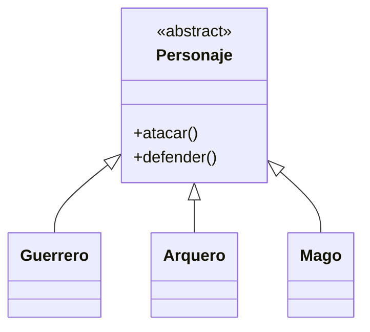
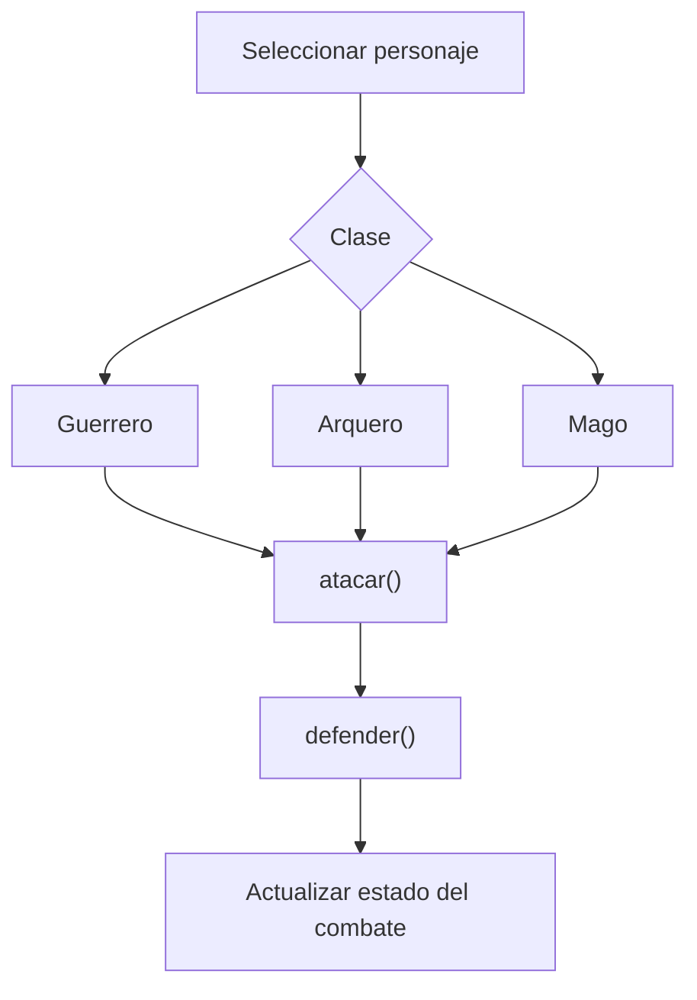

# Caso 12 - Sistema de videojuegos

## Diagrama UML

```mermaid
classDiagram
    class Personaje {
        <<abstract>>
        +atacar()
        +defender()
    }

    class Guerrero
    class Arquero
    class Mago

    Personaje <|-- Guerrero
    Personaje <|-- Arquero
    Personaje <|-- Mago
```

## Proceso

```mermaid
flowchart TD
    A["Seleccionar personaje"] --> B{"Clase"}
    B --> C["Guerrero"]
    B --> D["Arquero"]
    B --> E["Mago"]
    C --> F["atacar()"]
    D --> F
    E --> F
    F --> G["defender()"]
    G --> H["Actualizar estado del combate"]
```

## Explicacion

`Personaje` define acciones comunes. Cada clase hija ataca y defiende de forma distinta.
