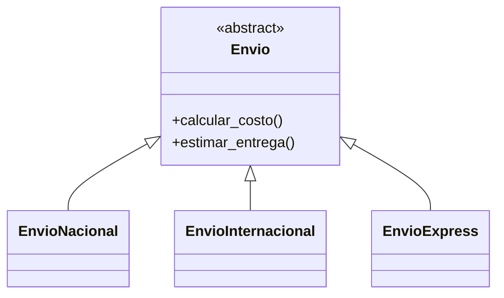
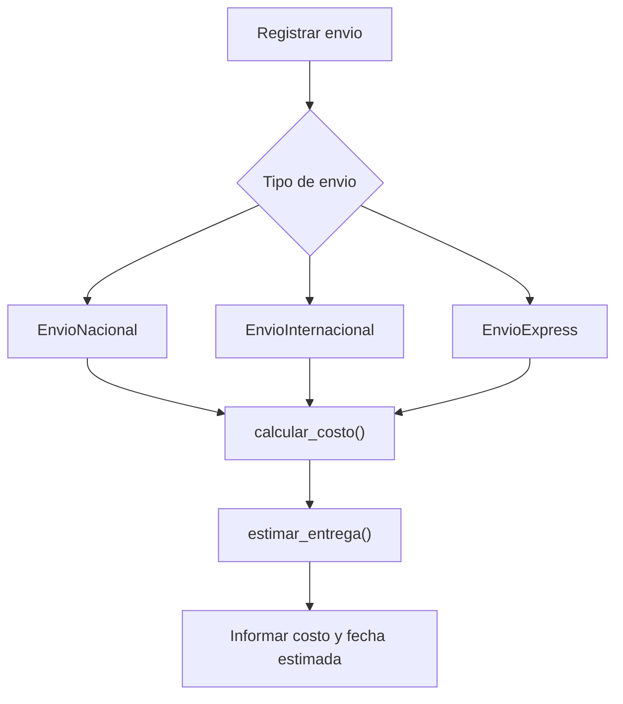

# Caso 13 - Empresa de mensajeria

## Diagrama UML

```mermaid
classDiagram
    class Envio {
        <<abstract>>
        +calcular_costo()
        +estimar_entrega()
    }

    class EnvioNacional
    class EnvioInternacional
    class EnvioExpress

    Envio <|-- EnvioNacional
    Envio <|-- EnvioInternacional
    Envio <|-- EnvioExpress
```

## Proceso

```mermaid
flowchart TD
    A["Registrar envio"] --> B{"Tipo de envio"}
    B --> C["EnvioNacional"]
    B --> D["EnvioInternacional"]
    B --> E["EnvioExpress"]
    C --> F["calcular_costo()"]
    D --> F
    E --> F
    F --> G["estimar_entrega()"]
    G --> H["Informar costo y fecha estimada"]
```

## Explicacion

`Envio` es la clase base. Cada envio calcula costo y tiempo segun distancia, destino y prioridad.
