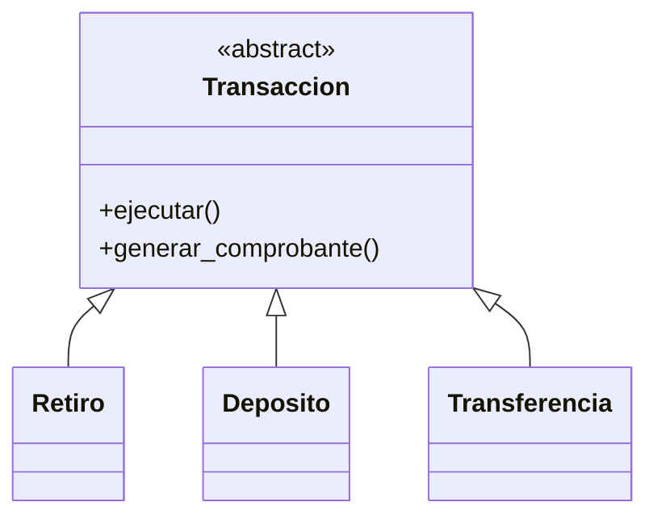
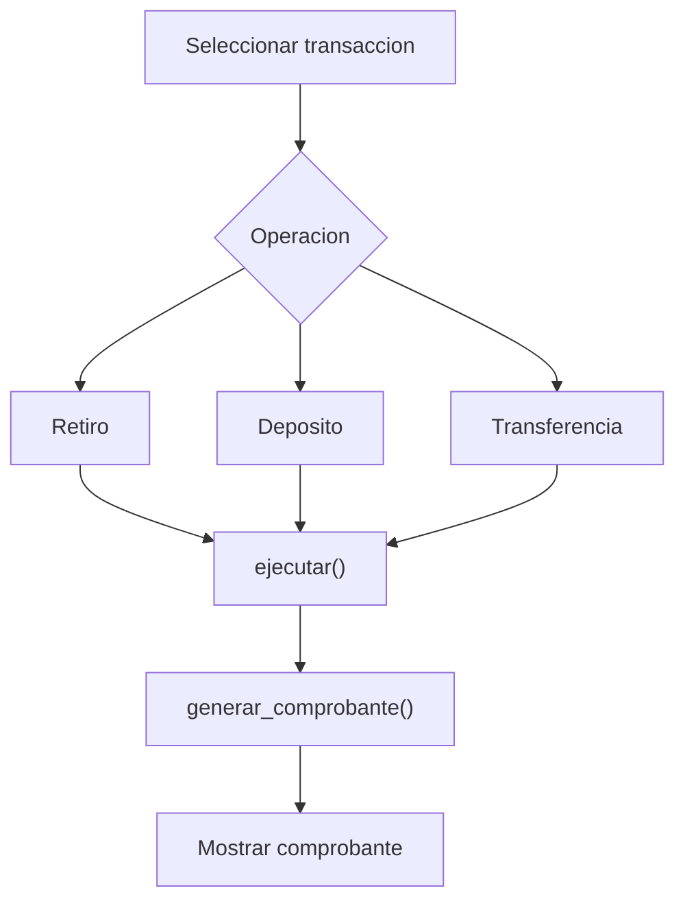

# Caso 14 - Cajero automatico

## Diagrama UML

```mermaid
classDiagram
    class Transaccion {
        <<abstract>>
        +ejecutar()
        +generar_comprobante()
    }

    class Retiro
    class Deposito
    class Transferencia

    Transaccion <|-- Retiro
    Transaccion <|-- Deposito
    Transaccion <|-- Transferencia
```

## Proceso

```mermaid
flowchart TD
    A["Seleccionar transaccion"] --> B{"Operacion"}
    B --> C["Retiro"]
    B --> D["Deposito"]
    B --> E["Transferencia"]
    C --> F["ejecutar()"]
    D --> F
    E --> F
    F --> G["generar_comprobante()"]
    G --> H["Mostrar comprobante"]
```

## Explicacion

`Transaccion` define el contrato comun. Las transacciones hijas ejecutan operaciones bancarias diferentes.
