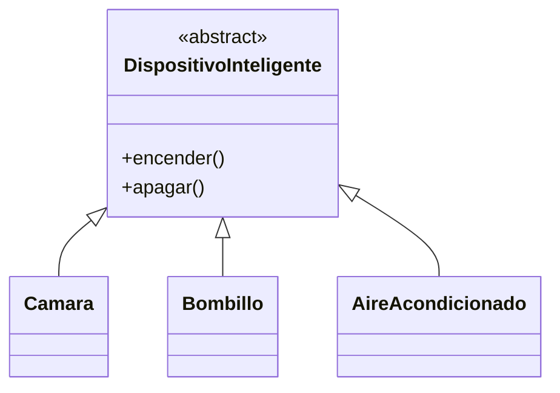
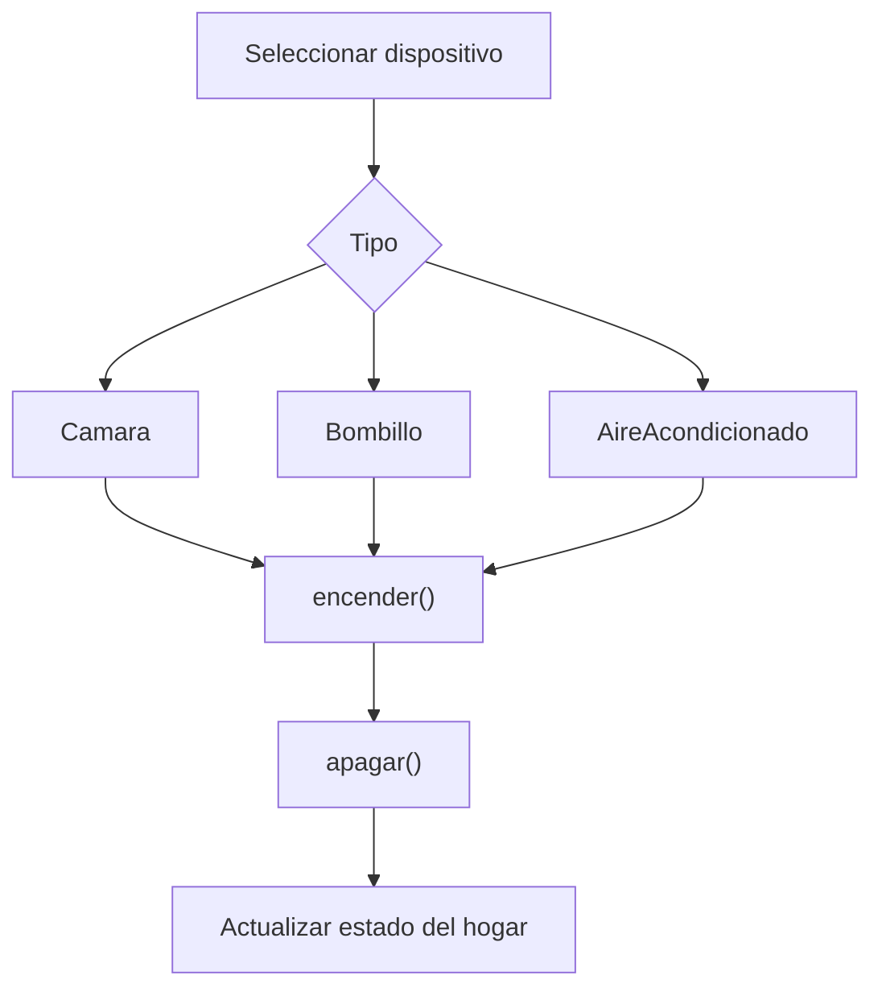

# Caso 15 - Smart Home

## Diagrama UML

```mermaid
classDiagram
    class DispositivoInteligente {
        <<abstract>>
        +encender()
        +apagar()
    }

    class Camara
    class Bombillo
    class AireAcondicionado

    DispositivoInteligente <|-- Camara
    DispositivoInteligente <|-- Bombillo
    DispositivoInteligente <|-- AireAcondicionado
```

## Proceso

```mermaid
flowchart TD
    A["Seleccionar dispositivo"] --> B{"Tipo"}
    B --> C["Camara"]
    B --> D["Bombillo"]
    B --> E["AireAcondicionado"]
    C --> F["encender()"]
    D --> F
    E --> F
    F --> G["apagar()"]
    G --> H["Actualizar estado del hogar"]
```

## Explicacion

`DispositivoInteligente` agrupa acciones comunes. Cada dispositivo implementa su encendido y apagado.
