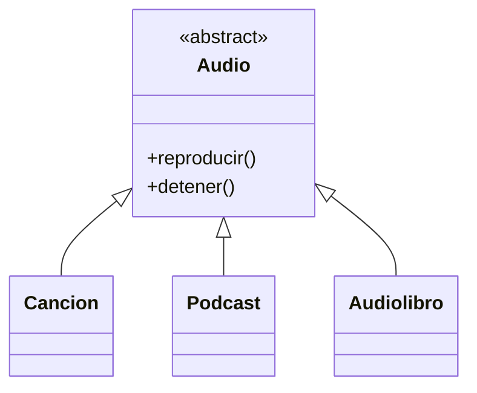
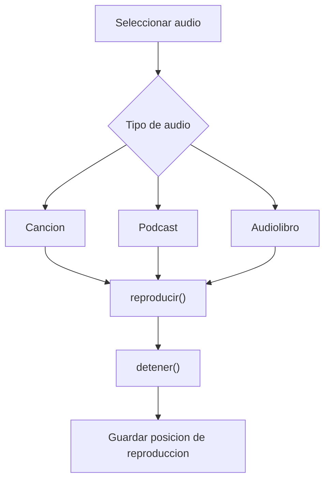

# Caso 16 - Plataforma de musica

## Diagrama UML

## Proceso

## Explicacion

`Audio` define el comportamiento comun. Canciones, podcasts y audiolibros se reproducen y detienen con el mismo contrato.
