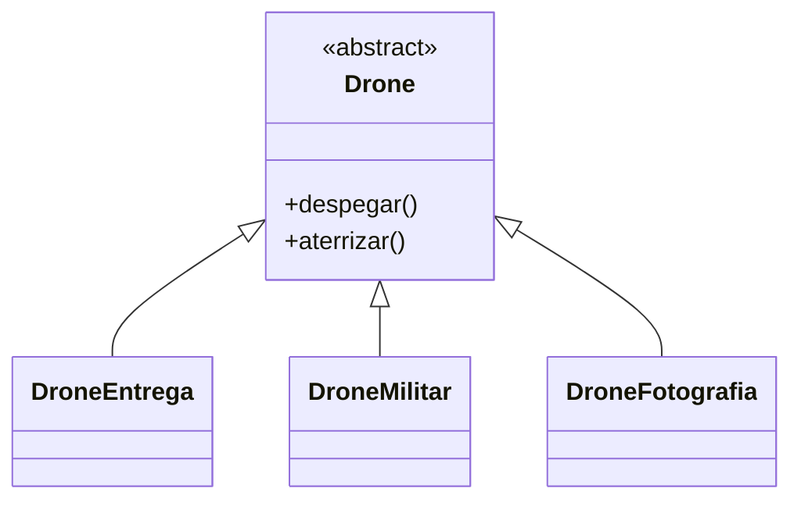
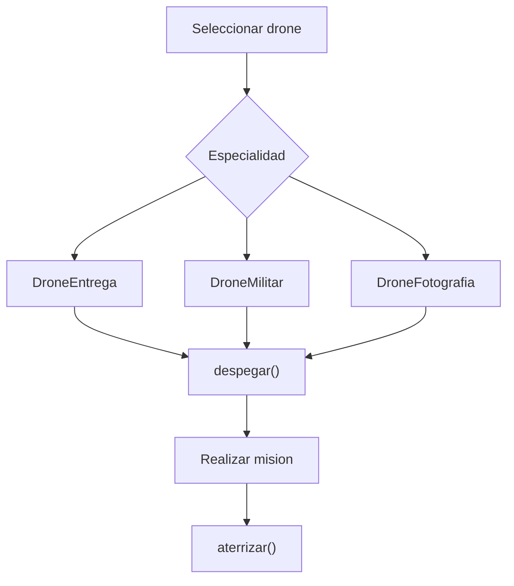

# Caso 17 - Empresa de drones

## Diagrama UML

```mermaid
classDiagram
    class Drone {
        <<abstract>>
        +despegar()
        +aterrizar()
    }

    class DroneEntrega
    class DroneMilitar
    class DroneFotografia

    Drone <|-- DroneEntrega
    Drone <|-- DroneMilitar
    Drone <|-- DroneFotografia
```

## Proceso

```mermaid
flowchart TD
    A["Seleccionar drone"] --> B{"Especialidad"}
    B --> C["DroneEntrega"]
    B --> D["DroneMilitar"]
    B --> E["DroneFotografia"]
    C --> F["despegar()"]
    D --> F
    E --> F
    F --> G["Realizar mision"]
    G --> H["aterrizar()"]
```

## Explicacion

`Drone` define operaciones basicas. Cada drone realiza una mision distinta despues de despegar.
