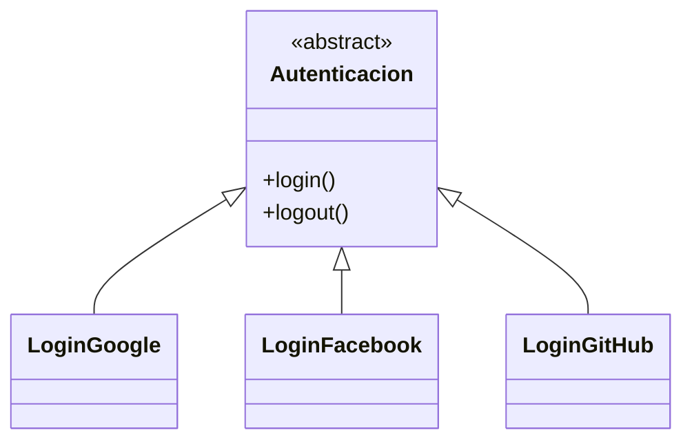
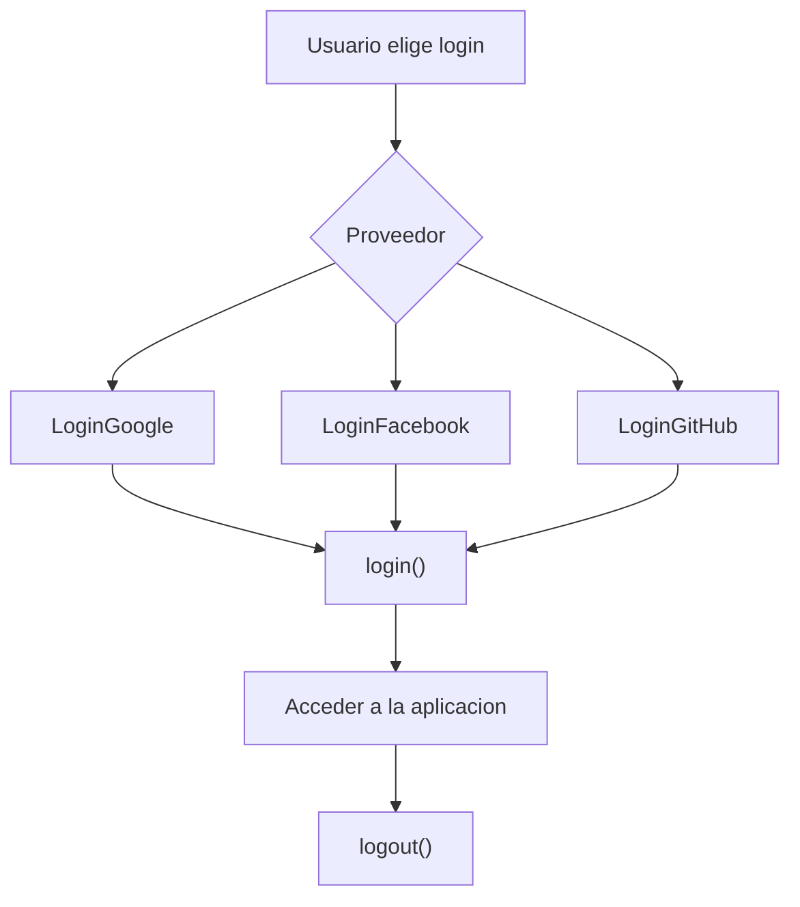

# Caso 18 - Sistema de autenticacion

## Diagrama UML

## Proceso

## Explicacion

`Autenticacion` define entrada y salida del sistema. Cada proveedor implementa su propia forma de iniciar sesion.
