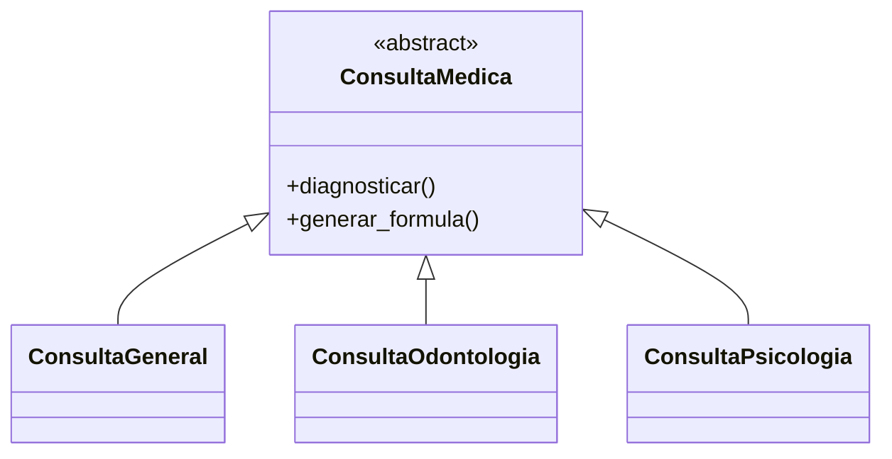
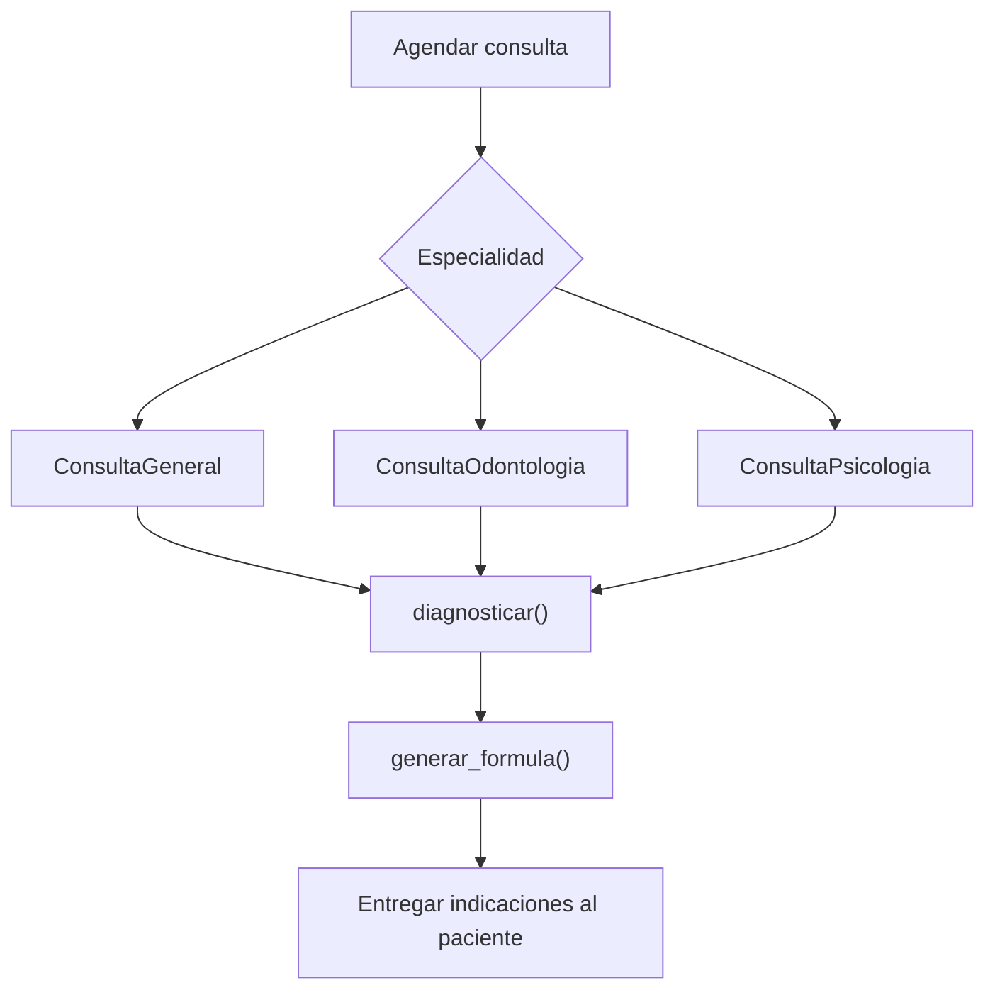

# Caso 19 - Plataforma de salud

## Diagrama UML

```mermaid
classDiagram
    class ConsultaMedica {
        <<abstract>>
        +diagnosticar()
        +generar_formula()
    }

    class ConsultaGeneral
    class ConsultaOdontologia
    class ConsultaPsicologia

    ConsultaMedica <|-- ConsultaGeneral
    ConsultaMedica <|-- ConsultaOdontologia
    ConsultaMedica <|-- ConsultaPsicologia
```

## Proceso

```mermaid
flowchart TD
    A["Agendar consulta"] --> B{"Especialidad"}
    B --> C["ConsultaGeneral"]
    B --> D["ConsultaOdontologia"]
    B --> E["ConsultaPsicologia"]
    C --> F["diagnosticar()"]
    D --> F
    E --> F
    F --> G["generar_formula()"]
    G --> H["Entregar indicaciones al paciente"]
```

## Explicacion

`ConsultaMedica` es la clase base. Cada consulta diagnostica y genera formula de acuerdo con su especialidad.
