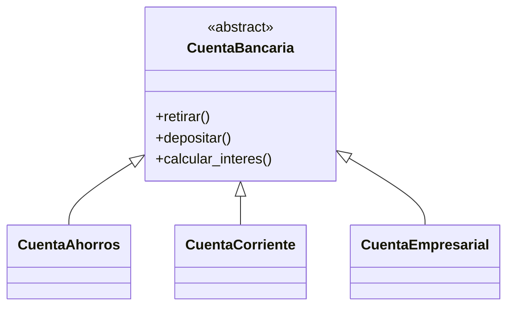
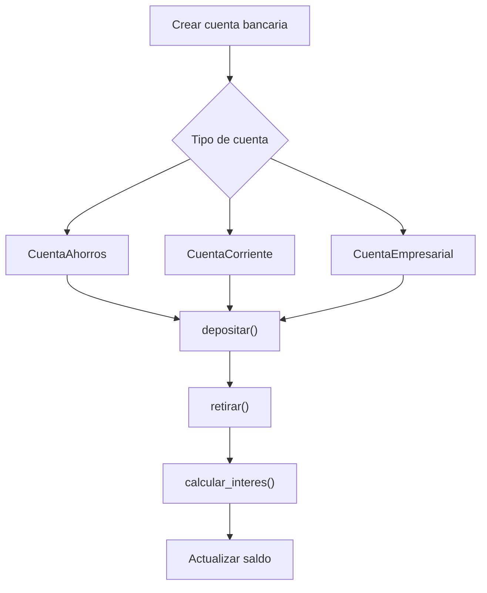

# Caso 2 - Banco digital

## Diagrama UML

## Proceso

## Explicacion

`CuentaBancaria` define las operaciones comunes. Cada tipo de cuenta puede aplicar reglas diferentes para retiros, depositos e intereses.
