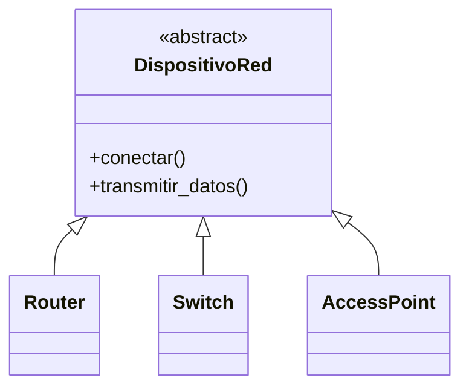
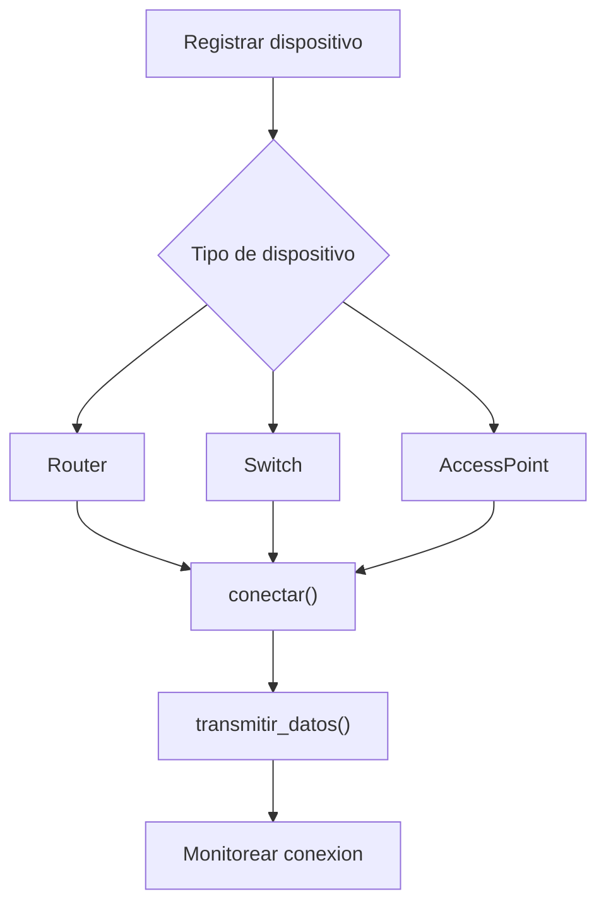

# Caso 20 - Sistema de redes

## Diagrama UML

```mermaid
classDiagram
    class DispositivoRed {
        <<abstract>>
        +conectar()
        +transmitir_datos()
    }

    class Router
    class Switch
    class AccessPoint

    DispositivoRed <|-- Router
    DispositivoRed <|-- Switch
    DispositivoRed <|-- AccessPoint
```

## Proceso

```mermaid
flowchart TD
    A["Registrar dispositivo"] --> B{"Tipo de dispositivo"}
    B --> C["Router"]
    B --> D["Switch"]
    B --> E["AccessPoint"]
    C --> F["conectar()"]
    D --> F
    E --> F
    F --> G["transmitir_datos()"]
    G --> H["Monitorear conexion"]
```

## Explicacion

`DispositivoRed` define conexion y transmision. Cada dispositivo cumple ese contrato con funciones de red diferentes.
