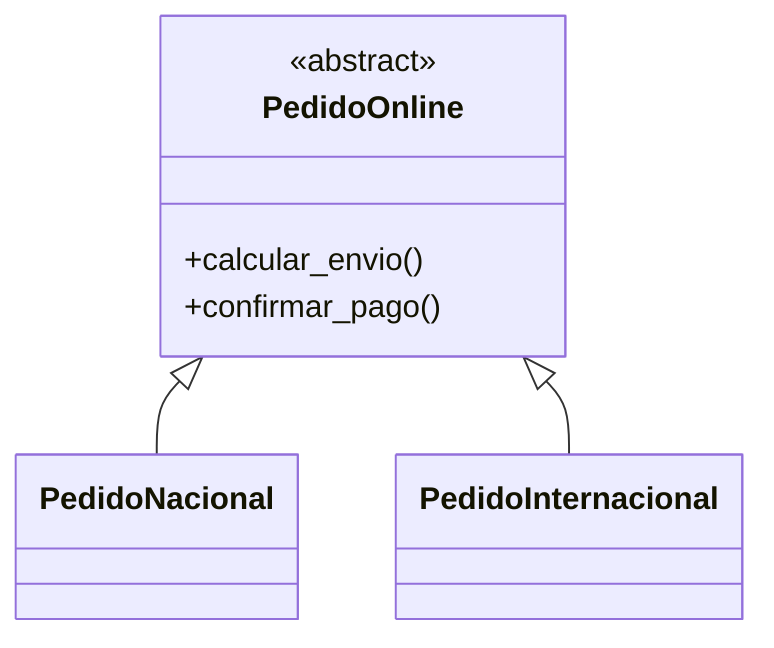
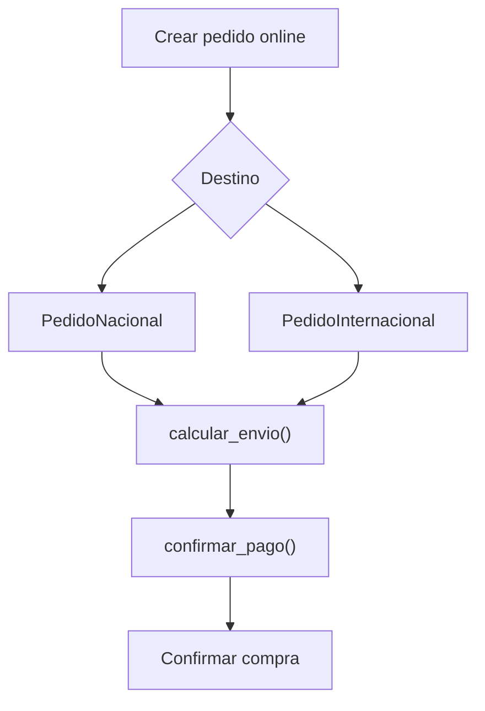

# Caso 21 - Comercio electronico

## Diagrama UML

```mermaid
classDiagram
    class PedidoOnline {
        <<abstract>>
        +calcular_envio()
        +confirmar_pago()
    }

    class PedidoNacional
    class PedidoInternacional

    PedidoOnline <|-- PedidoNacional
    PedidoOnline <|-- PedidoInternacional
```

## Proceso

```mermaid
flowchart TD
    A["Crear pedido online"] --> B{"Destino"}
    B --> C["PedidoNacional"]
    B --> D["PedidoInternacional"]
    C --> E["calcular_envio()"]
    D --> E
    E --> F["confirmar_pago()"]
    F --> G["Confirmar compra"]
```

## Explicacion

`PedidoOnline` define envio y pago. Los pedidos nacionales e internacionales calculan envio con reglas distintas.
