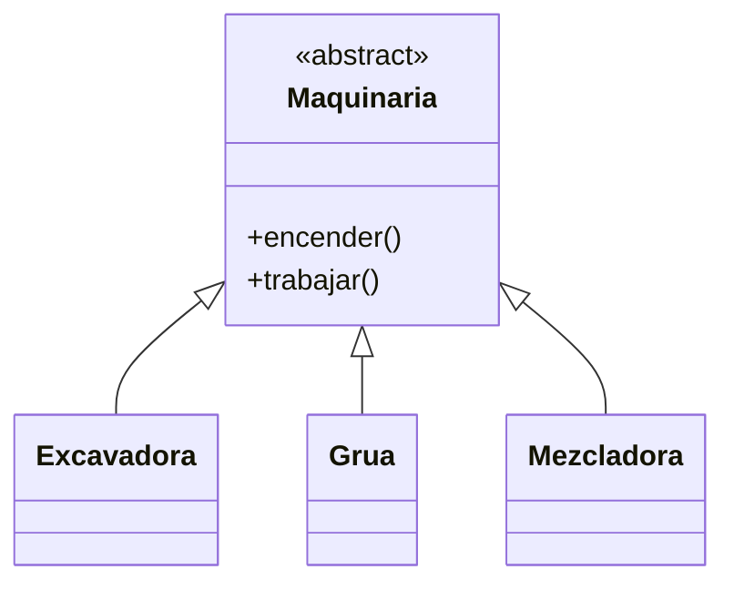
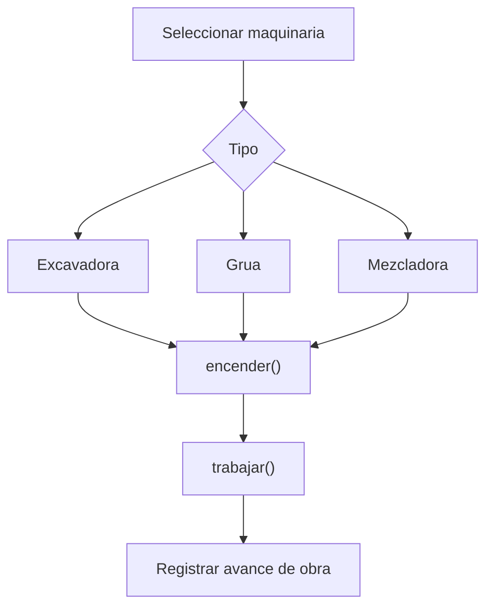

# Caso 22 - Empresa de construccion

## Diagrama UML

```mermaid
classDiagram
    class Maquinaria {
        <<abstract>>
        +encender()
        +trabajar()
    }

    class Excavadora
    class Grua
    class Mezcladora

    Maquinaria <|-- Excavadora
    Maquinaria <|-- Grua
    Maquinaria <|-- Mezcladora
```

## Proceso

```mermaid
flowchart TD
    A["Seleccionar maquinaria"] --> B{"Tipo"}
    B --> C["Excavadora"]
    B --> D["Grua"]
    B --> E["Mezcladora"]
    C --> F["encender()"]
    D --> F
    E --> F
    F --> G["trabajar()"]
    G --> H["Registrar avance de obra"]
```

## Explicacion

`Maquinaria` define operaciones comunes. Cada maquina trabaja de forma especializada en la construccion.
