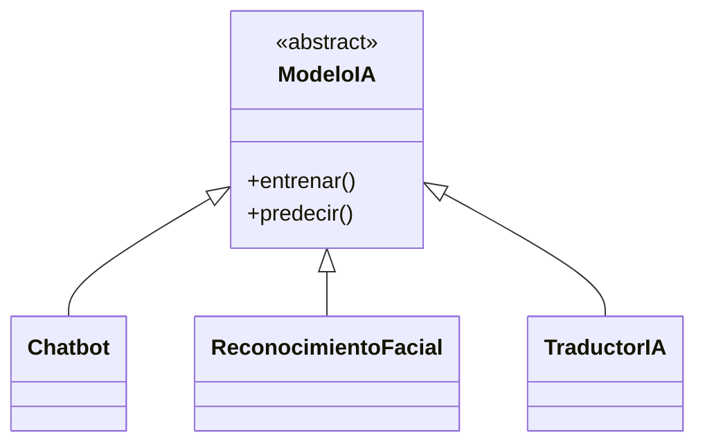
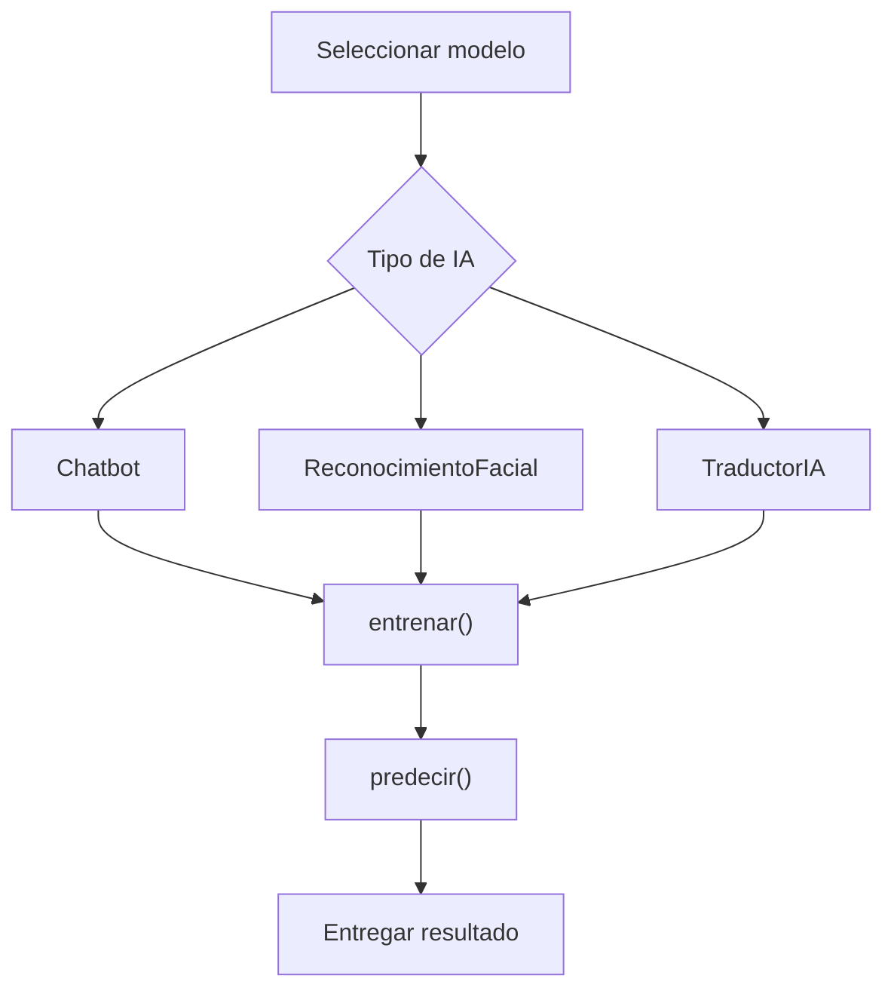

# Caso 23 - Plataforma de IA

## Diagrama UML

```mermaid
classDiagram
    class ModeloIA {
        <<abstract>>
        +entrenar()
        +predecir()
    }

    class Chatbot
    class ReconocimientoFacial
    class TraductorIA

    ModeloIA <|-- Chatbot
    ModeloIA <|-- ReconocimientoFacial
    ModeloIA <|-- TraductorIA
```

## Proceso

```mermaid
flowchart TD
    A["Seleccionar modelo"] --> B{"Tipo de IA"}
    B --> C["Chatbot"]
    B --> D["ReconocimientoFacial"]
    B --> E["TraductorIA"]
    C --> F["entrenar()"]
    D --> F
    E --> F
    F --> G["predecir()"]
    G --> H["Entregar resultado"]
```

## Explicacion

`ModeloIA` define entrenamiento y prediccion. Cada modelo usa esos pasos para resolver tareas distintas.
