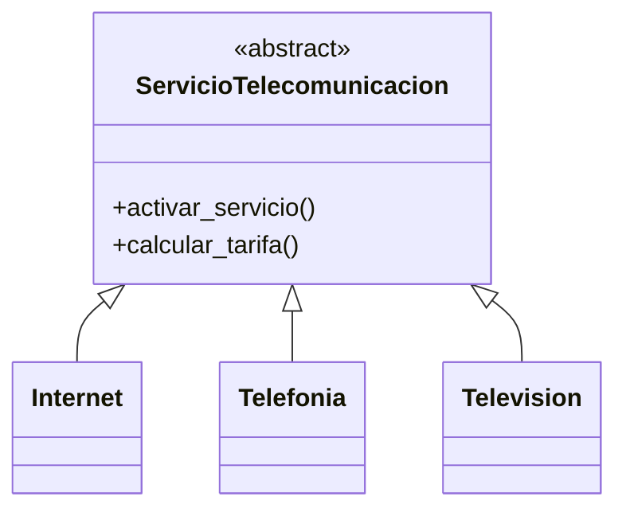
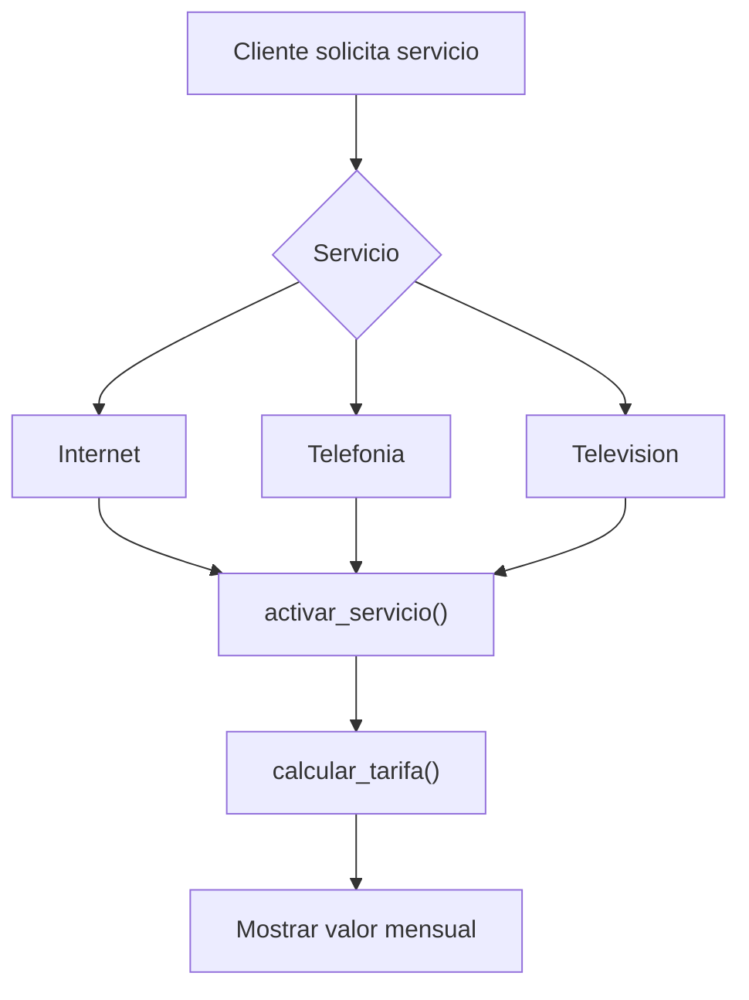

# Caso 24 - Empresa de telecomunicaciones

## Diagrama UML

## Proceso

## Explicacion

`ServicioTelecomunicacion` define activacion y tarifa. Cada servicio calcula el cobro de acuerdo con sus caracteristicas.
