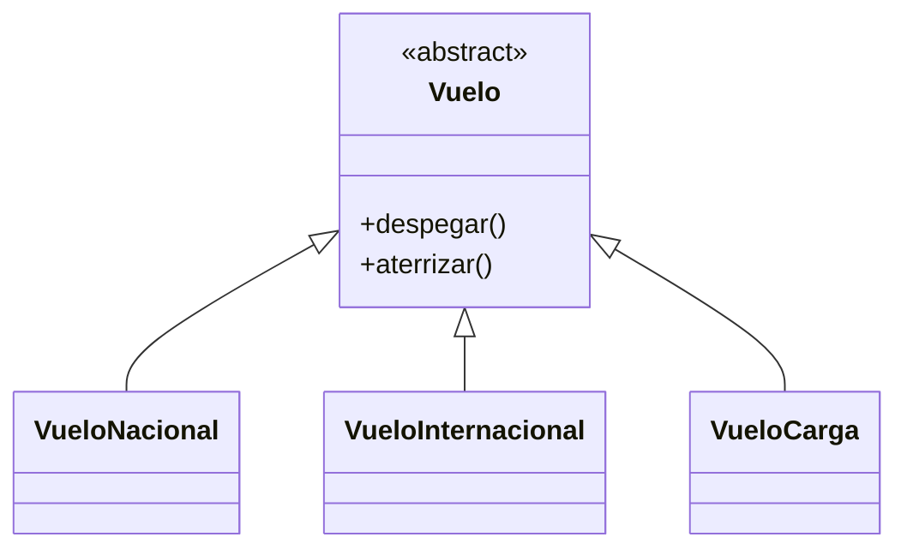
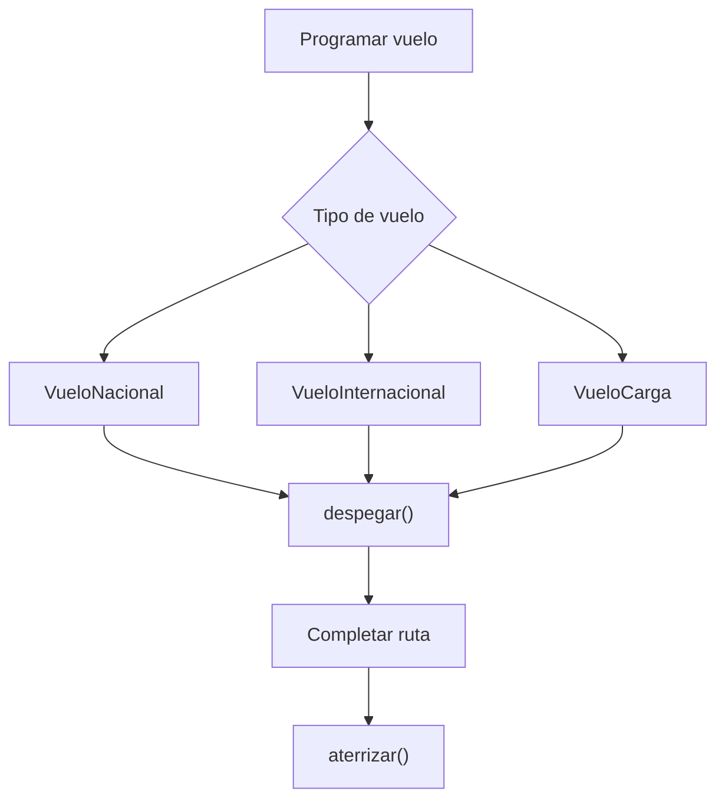

# Caso 25 - Aeropuerto internacional

## Diagrama UML

## Proceso

## Explicacion

`Vuelo` define las operaciones principales. Cada tipo de vuelo despega y aterriza siguiendo reglas distintas del aeropuerto.
