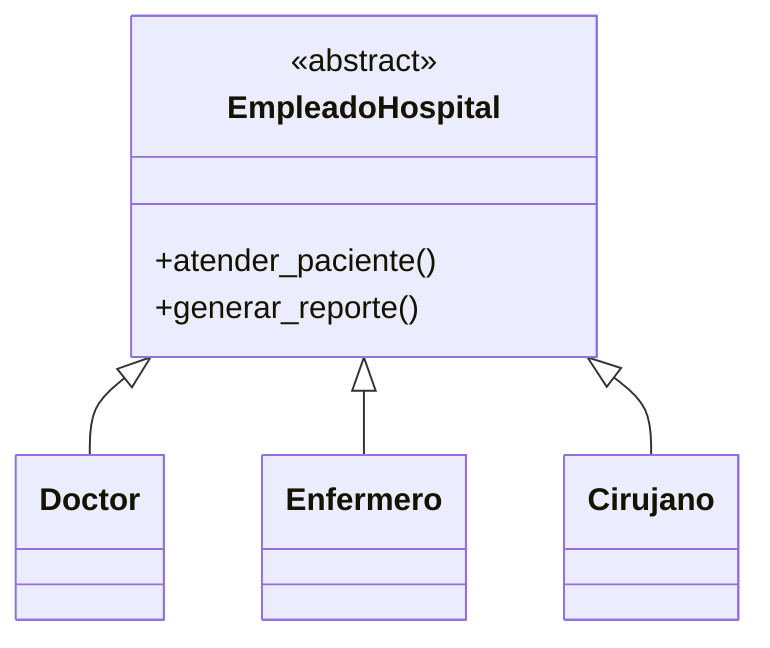
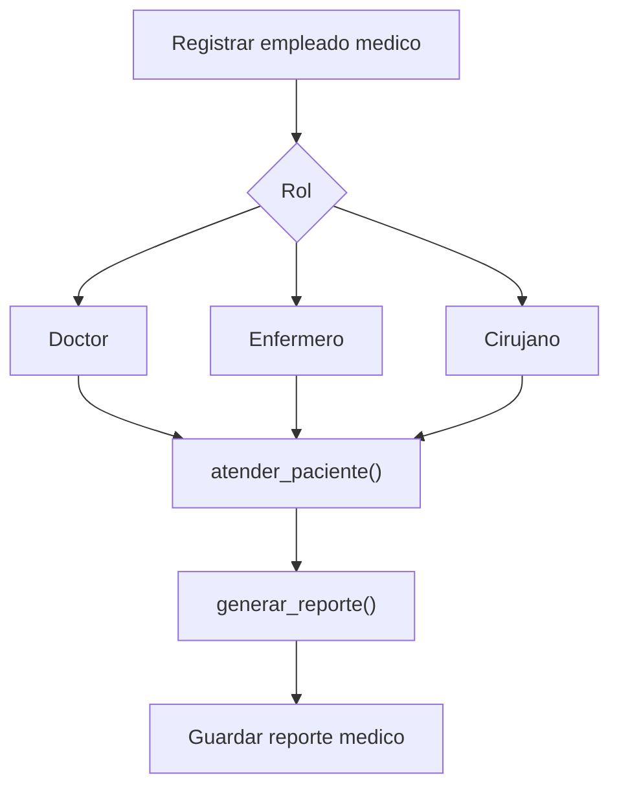

# Caso 3 - Hospital moderno

## Diagrama UML

```mermaid
classDiagram
    class EmpleadoHospital {
        <<abstract>>
        +atender_paciente()
        +generar_reporte()
    }

    class Doctor
    class Enfermero
    class Cirujano

    EmpleadoHospital <|-- Doctor
    EmpleadoHospital <|-- Enfermero
    EmpleadoHospital <|-- Cirujano
```

## Proceso

```mermaid
flowchart TD
    A["Registrar empleado medico"] --> B{"Rol"}
    B --> C["Doctor"]
    B --> D["Enfermero"]
    B --> E["Cirujano"]
    C --> F["atender_paciente()"]
    D --> F
    E --> F
    F --> G["generar_reporte()"]
    G --> H["Guardar reporte medico"]
```

## Explicacion

`EmpleadoHospital` es la plantilla general. Las clases hijas atienden pacientes y generan reportes segun su rol.
