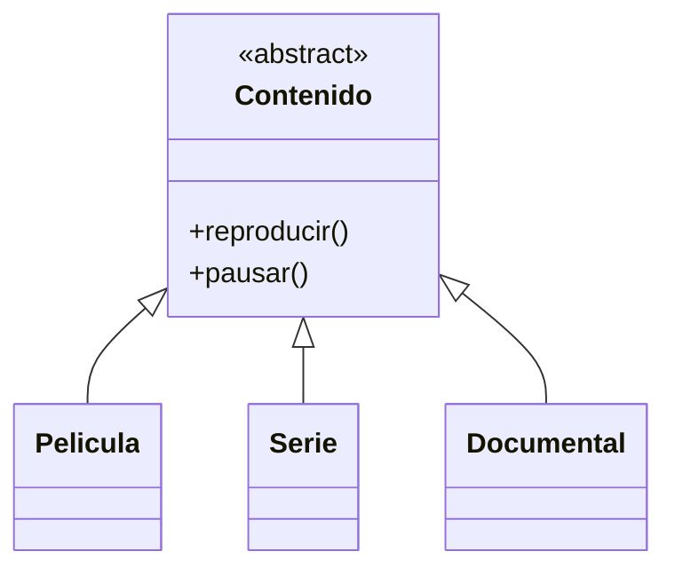
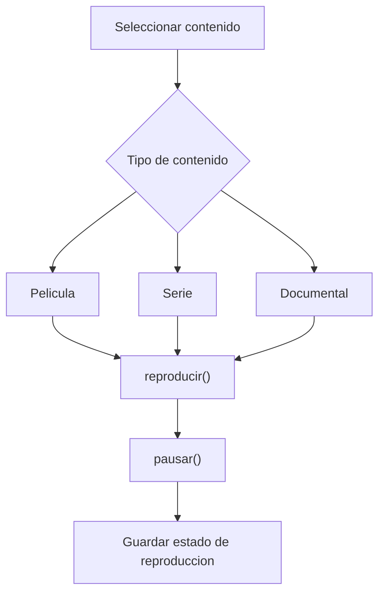

# Caso 4 - Plataforma de streaming

## Diagrama UML

## Proceso

## Explicacion

`Contenido` representa cualquier multimedia. Las clases hijas permiten reproducir y pausar elementos distintos de la plataforma.
