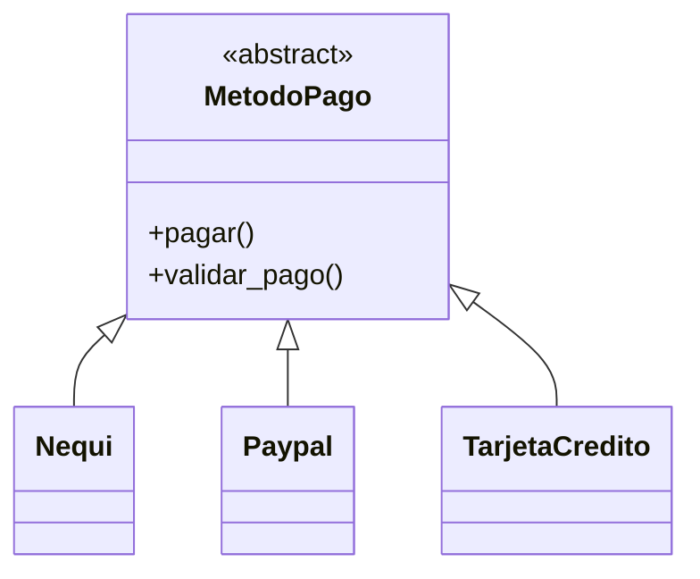
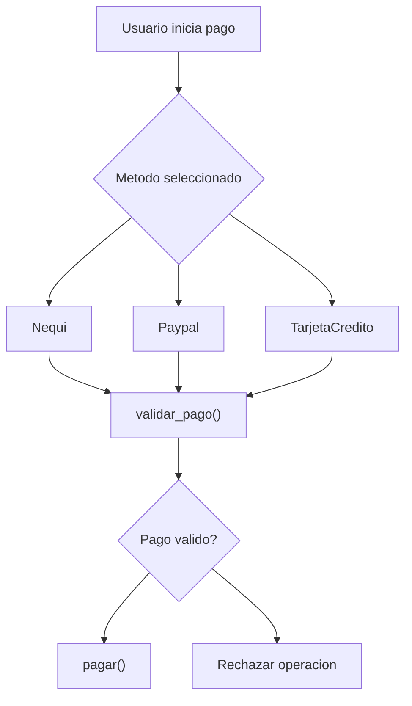

# Caso 6 - Aplicacion bancaria movil

## Diagrama UML

```mermaid
classDiagram
    class MetodoPago {
        <<abstract>>
        +pagar()
        +validar_pago()
    }

    class Nequi
    class Paypal
    class TarjetaCredito

    MetodoPago <|-- Nequi
    MetodoPago <|-- Paypal
    MetodoPago <|-- TarjetaCredito
```

## Proceso

```mermaid
flowchart TD
    A["Usuario inicia pago"] --> B{"Metodo seleccionado"}
    B --> C["Nequi"]
    B --> D["Paypal"]
    B --> E["TarjetaCredito"]
    C --> F["validar_pago()"]
    D --> F
    E --> F
    F --> G{"Pago valido?"}
    G --> H["pagar()"]
    G --> I["Rechazar operacion"]
```

## Explicacion

`MetodoPago` define las acciones comunes. Cada clase hija valida y procesa el pago segun su plataforma.
