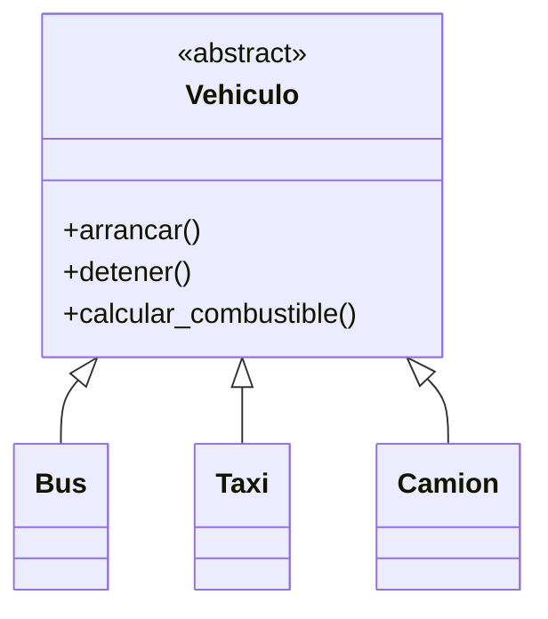
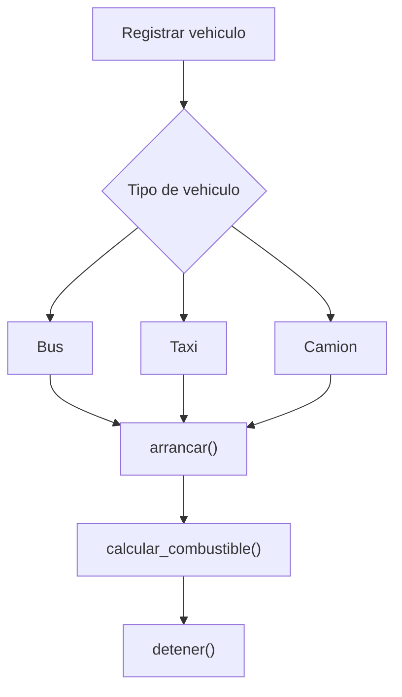

# Caso 7 - Empresa de transporte

## Diagrama UML

## Proceso

## Explicacion

`Vehiculo` agrupa las operaciones comunes. Cada vehiculo calcula combustible de acuerdo con su uso y caracteristicas.
