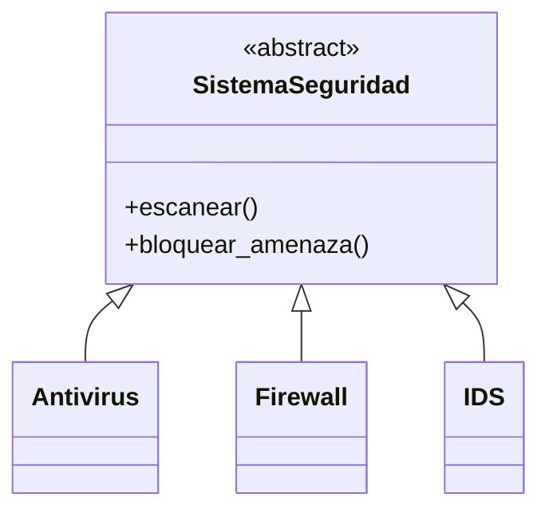
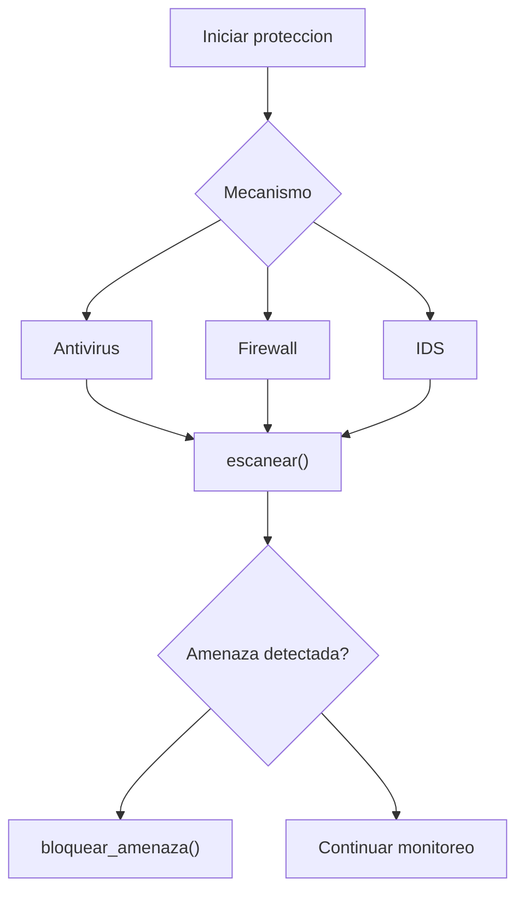

# Caso 8 - Sistema de seguridad informatica

## Diagrama UML

## Proceso

## Explicacion

`SistemaSeguridad` define el comportamiento base. Cada mecanismo escanea y bloquea amenazas de forma especializada.
