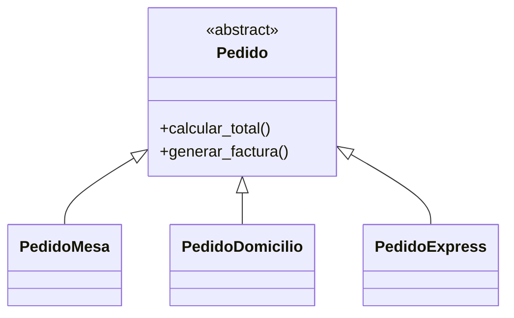
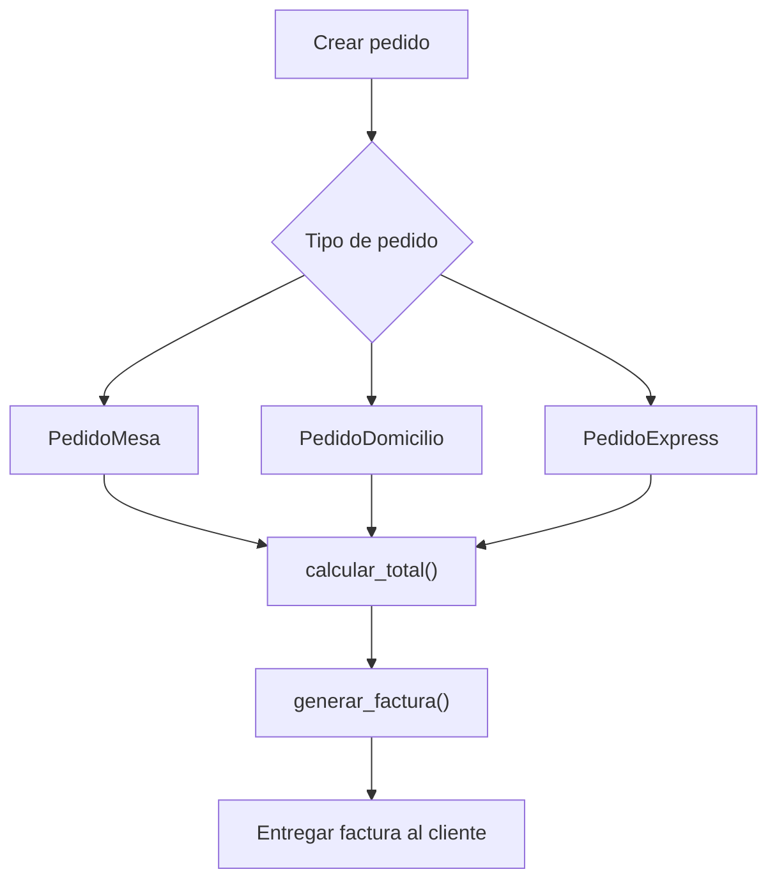

# Caso 9 - Restaurante inteligente

## Diagrama UML

## Proceso

## Explicacion

`Pedido` define las operaciones comunes. Cada tipo puede calcular total con reglas propias, como domicilio o prioridad express.
