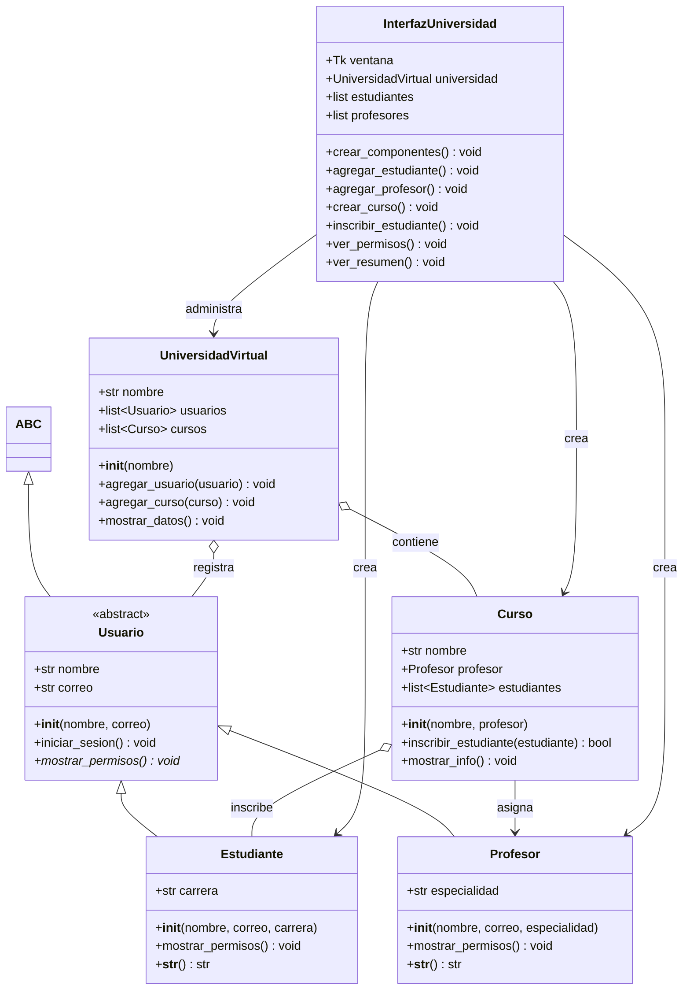
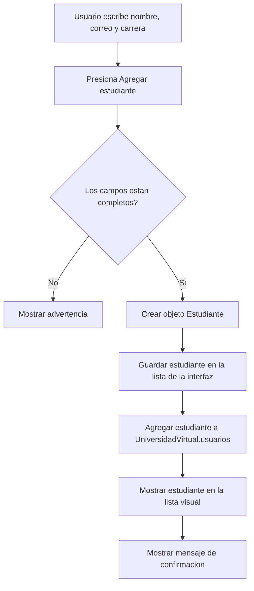
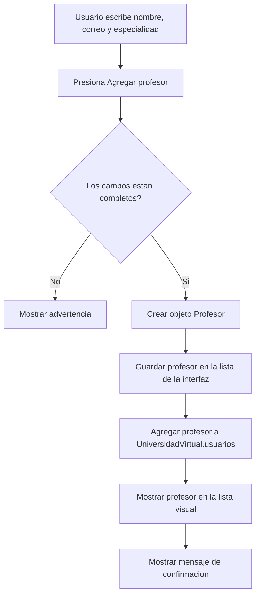
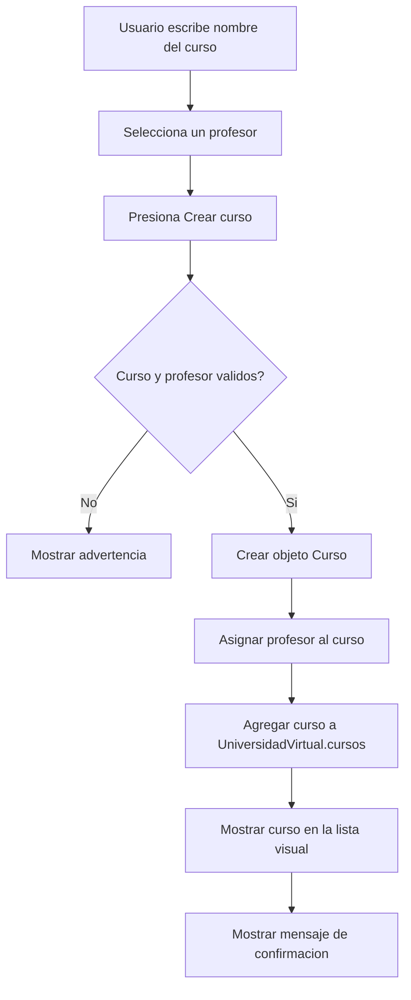
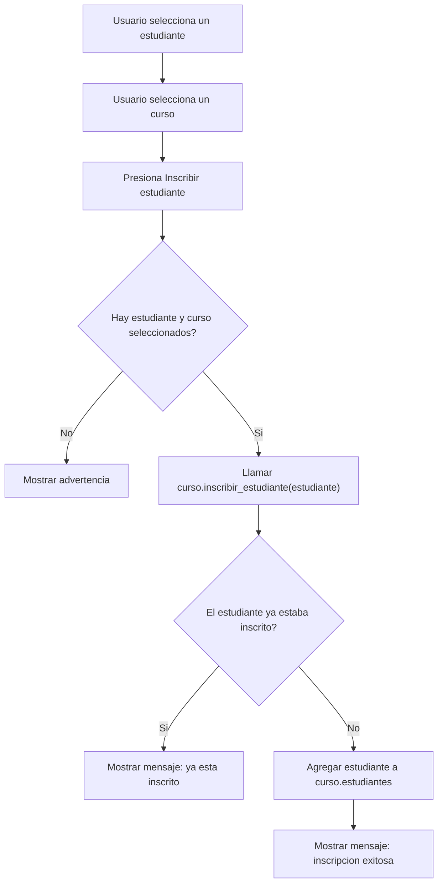
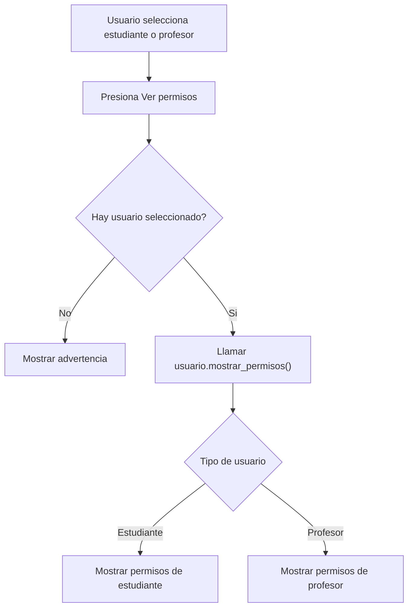
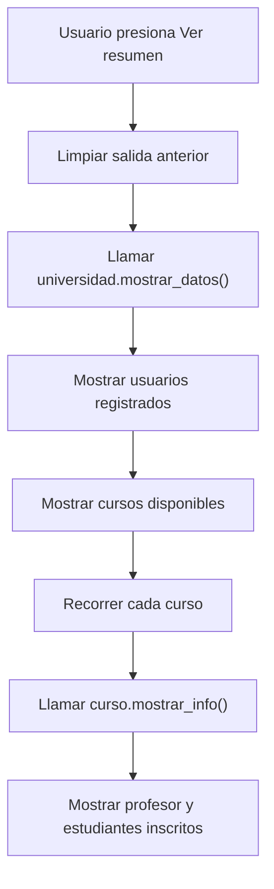

# Diagrama UML y procesos - Universidad Virtual

Este documento explica la estructura del programa y los procesos principales de la aplicacion.

## 1. Diagrama UML de clases

### Explicacion del UML

- `Usuario` es una clase abstracta: funciona como plantilla para usuarios concretos.
- `Estudiante` y `Profesor` heredan de `Usuario`, por eso reutilizan `nombre`, `correo` e `iniciar_sesion()`.
- `mostrar_permisos()` aplica polimorfismo: cada clase hija implementa permisos diferentes.
- `Curso` se relaciona con un `Profesor` y contiene una lista de `Estudiante`.
- `UniversidadVirtual` administra usuarios y cursos.
- `InterfazUniversidad` usa las clases anteriores para mostrar una interfaz grafica.

## 2. Proceso para agregar un estudiante

### Explicacion

La interfaz toma los datos escritos, valida que no esten vacios y crea un objeto `Estudiante`. Luego ese objeto se guarda tanto en la interfaz como en la universidad.

## 3. Proceso para agregar un profesor

### Explicacion

Este proceso es parecido al del estudiante, pero crea un objeto `Profesor`. La especialidad reemplaza a la carrera.

## 4. Proceso para crear un curso

### Explicacion

Para crear un curso se necesita un nombre y un profesor. El curso queda asociado al profesor seleccionado.

## 5. Proceso para inscribir estudiante en curso

### Explicacion

El metodo `inscribir_estudiante()` evita duplicados. Si el estudiante ya existe dentro del curso, no lo vuelve a agregar.

## 6. Proceso para ver permisos

### Explicacion

Aqui se ve el polimorfismo: la interfaz llama el mismo metodo `mostrar_permisos()`, pero la respuesta cambia segun si el objeto es `Estudiante` o `Profesor`.

## 7. Proceso para ver resumen

### Explicacion

El resumen consulta los objetos guardados en `UniversidadVirtual` y en cada `Curso`. No crea datos nuevos, solo muestra el estado actual del sistema.

## 8. Conceptos POO usados

| Concepto | Donde aparece | Explicacion |
| --- | --- | --- |
| Clase | `Estudiante`, `Profesor`, `Curso` | Molde para crear objetos. |
| Objeto | `estudiante = Estudiante(...)` | Instancia real creada desde una clase. |
| Atributo | `nombre`, `correo`, `carrera` | Dato guardado dentro del objeto. |
| Metodo | `mostrar_permisos()` | Funcion que pertenece a una clase. |
| Herencia | `Estudiante(Usuario)` | Una clase hija reutiliza codigo de una clase padre. |
| Abstraccion | `Usuario(ABC)` | Define una plantilla general sin crear usuarios genericos. |
| Polimorfismo | `mostrar_permisos()` | El mismo metodo tiene comportamiento distinto segun la clase. |
| Composicion | `Curso` contiene estudiantes | Un objeto esta formado o relacionado con otros objetos. |
| Encapsulamiento | `self.nombre`, `self.cursos` | Los datos se agrupan dentro del objeto que los usa. |
