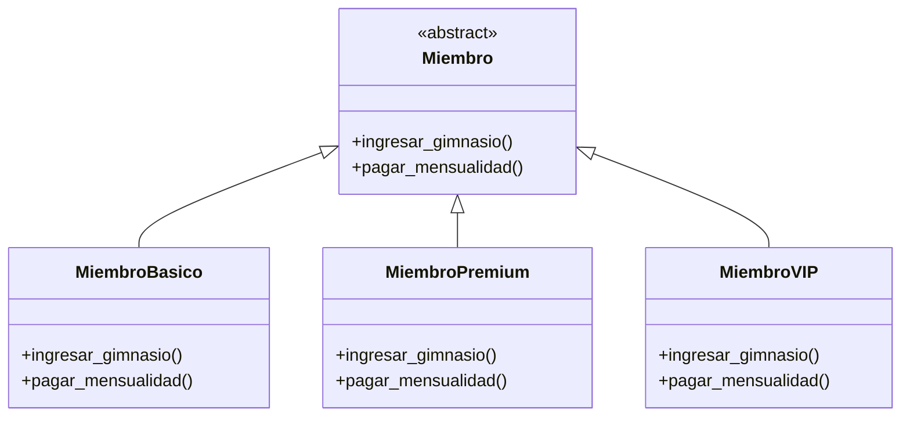
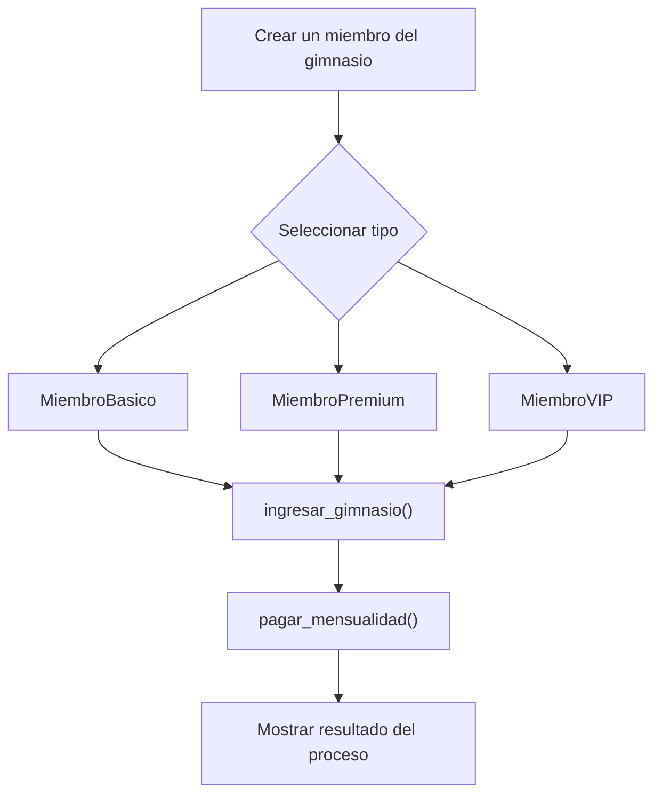

# Caso 1 - Sistema de gimnasio

## Diagrama UML

## Proceso

## Explicacion

`Miembro` es una clase abstracta que define el comportamiento comun del sistema mediante los metodos `ingresar_gimnasio()` y `pagar_mensualidad()`.

Las clases hijas (`MiembroBasico`, `MiembroPremium`, `MiembroVIP`) heredan de `Miembro` y pueden especializar esos metodos para representar tipos de membresia con beneficios y reglas de pago diferentes. Esto aplica el principio de herencia y permite tratar todos los objetos como `Miembro` sin perder el comportamiento particular de cada tipo.
