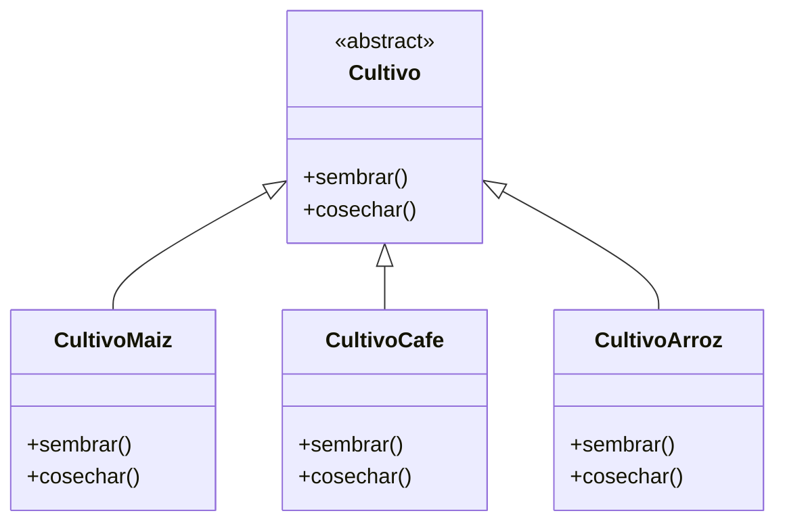
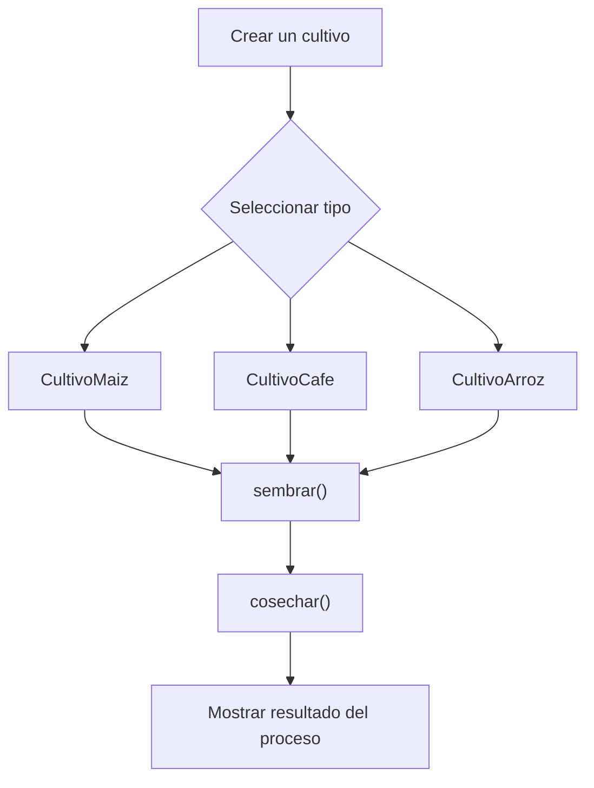

# Caso 10 - Empresa agricola

## Diagrama UML

## Proceso

## Explicacion

`Cultivo` es una clase abstracta que define el comportamiento comun del sistema mediante los metodos `sembrar()` y `cosechar()`.

Las clases hijas (`CultivoMaiz`, `CultivoCafe`, `CultivoArroz`) heredan de `Cultivo` y pueden especializar esos metodos para representar cultivos con ciclos de siembra y cosecha diferentes. Esto aplica el principio de herencia y permite tratar todos los objetos como `Cultivo` sin perder el comportamiento particular de cada tipo.
