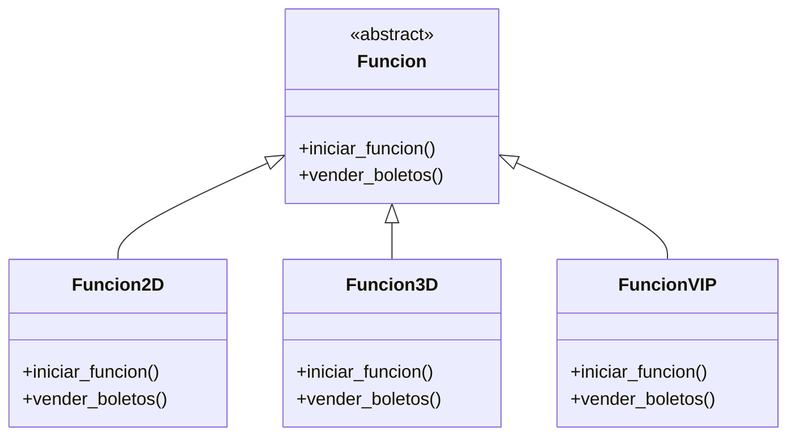
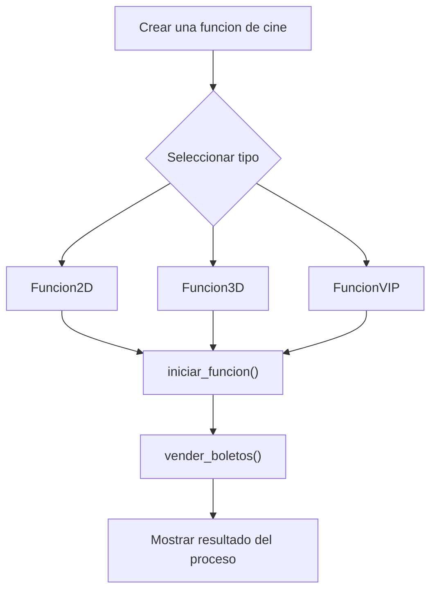

# Caso 11 - Sistema de cine

## Diagrama UML

## Proceso

## Explicacion

`Funcion` es una clase abstracta que define el comportamiento comun del sistema mediante los metodos `iniciar_funcion()` y `vender_boletos()`.

Las clases hijas (`Funcion2D`, `Funcion3D`, `FuncionVIP`) heredan de `Funcion` y pueden especializar esos metodos para representar funciones con experiencia, precio y salas diferentes. Esto aplica el principio de herencia y permite tratar todos los objetos como `Funcion` sin perder el comportamiento particular de cada tipo.
