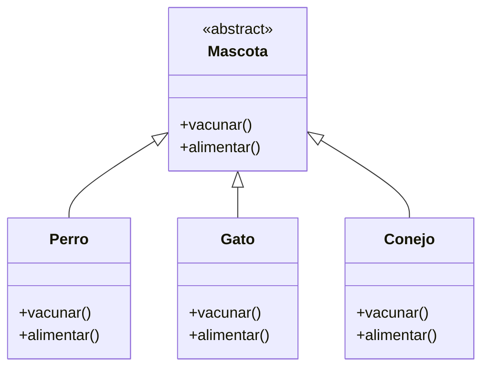
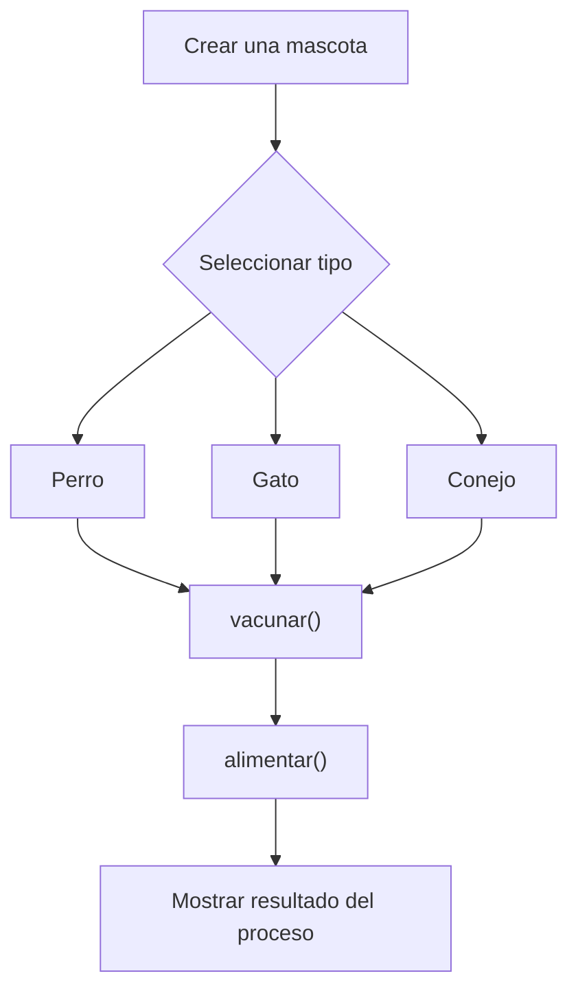

# Caso 12 - Plataforma de mascotas

## Diagrama UML

## Proceso

## Explicacion

`Mascota` es una clase abstracta que define el comportamiento comun del sistema mediante los metodos `vacunar()` y `alimentar()`.

Las clases hijas (`Perro`, `Gato`, `Conejo`) heredan de `Mascota` y pueden especializar esos metodos para representar animales con cuidados, vacunas y alimentacion diferentes. Esto aplica el principio de herencia y permite tratar todos los objetos como `Mascota` sin perder el comportamiento particular de cada tipo.
