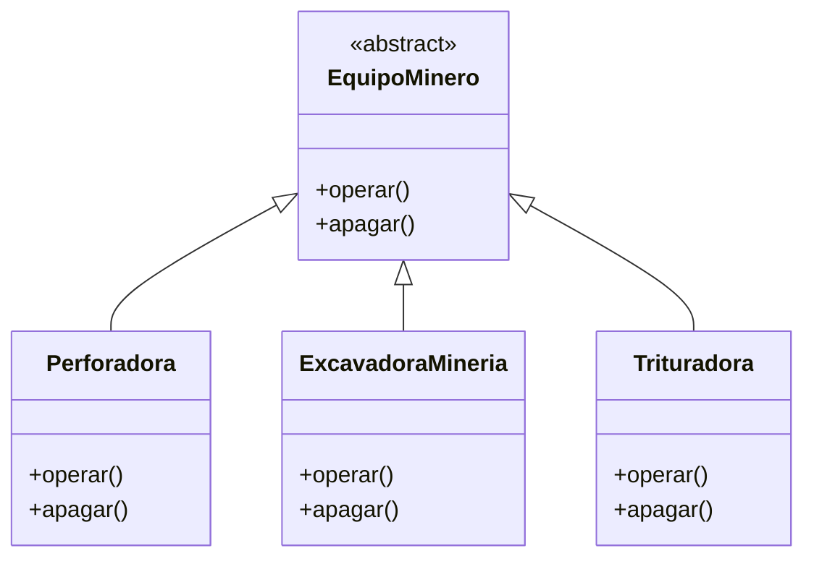
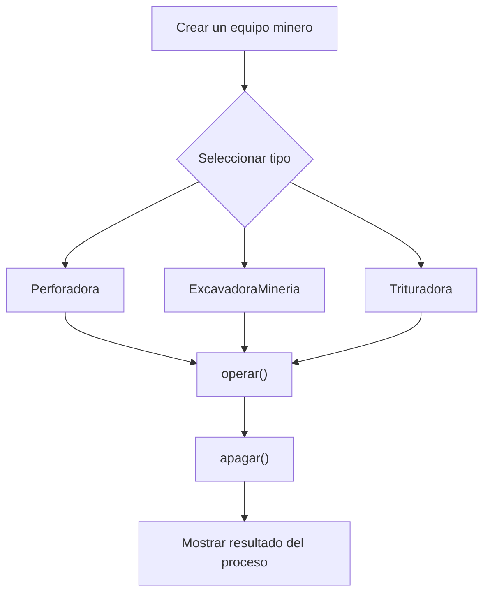

# Caso 13 - Empresa minera

## Diagrama UML

## Proceso

## Explicacion

`EquipoMinero` es una clase abstracta que define el comportamiento comun del sistema mediante los metodos `operar()` y `apagar()`.

Las clases hijas (`Perforadora`, `ExcavadoraMineria`, `Trituradora`) heredan de `EquipoMinero` y pueden especializar esos metodos para representar maquinas con operaciones y protocolos de apagado diferentes. Esto aplica el principio de herencia y permite tratar todos los objetos como `EquipoMinero` sin perder el comportamiento particular de cada tipo.
