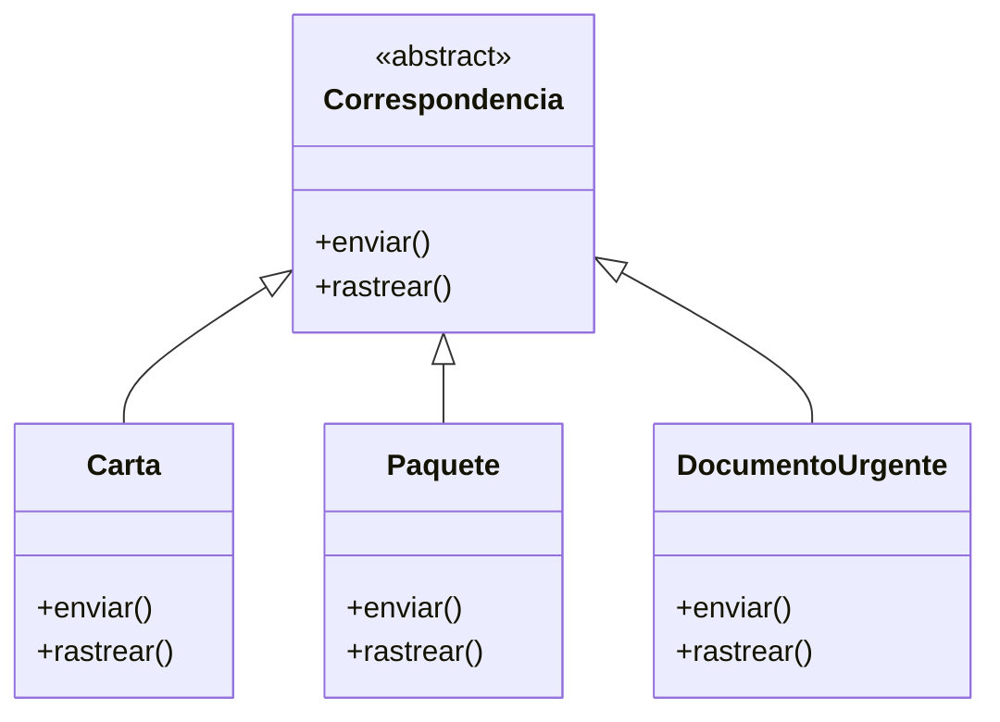
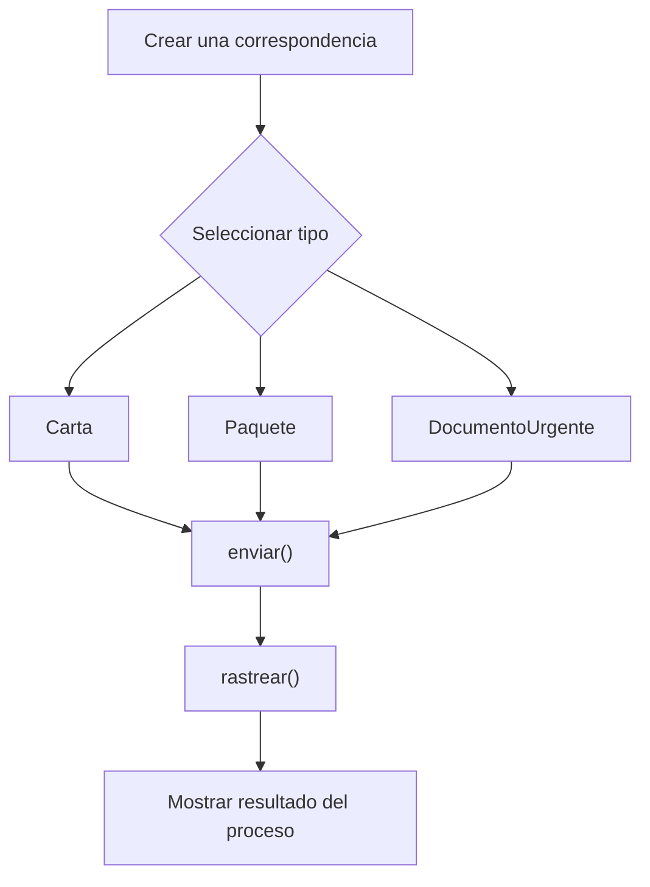

# Caso 14 - Sistema de correos

## Diagrama UML

## Proceso

## Explicacion

`Correspondencia` es una clase abstracta que define el comportamiento comun del sistema mediante los metodos `enviar()` y `rastrear()`.

Las clases hijas (`Carta`, `Paquete`, `DocumentoUrgente`) heredan de `Correspondencia` y pueden especializar esos metodos para representar envios con seguimiento, prioridad y manejo diferentes. Esto aplica el principio de herencia y permite tratar todos los objetos como `Correspondencia` sin perder el comportamiento particular de cada tipo.
