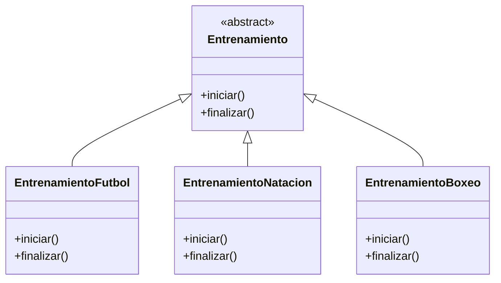
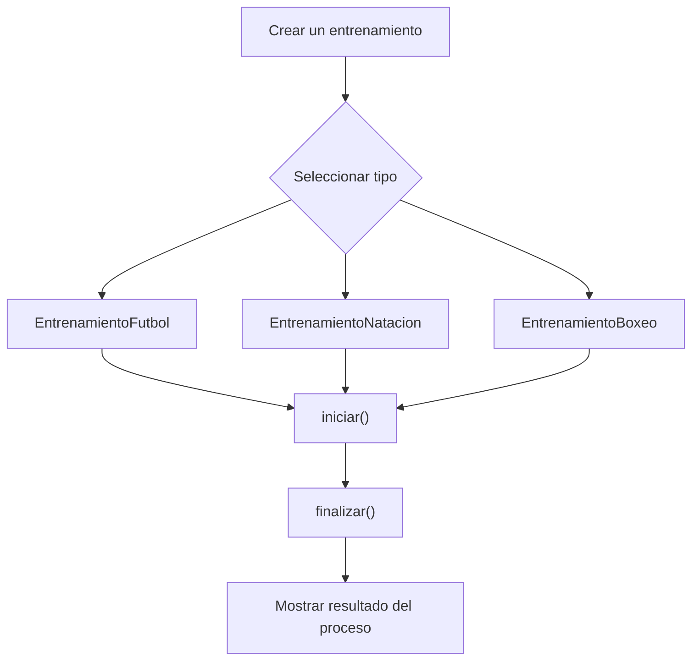

# Caso 15 - Plataforma de cursos deportivos

## Diagrama UML

## Proceso

## Explicacion

`Entrenamiento` es una clase abstracta que define el comportamiento comun del sistema mediante los metodos `iniciar()` y `finalizar()`.

Las clases hijas (`EntrenamientoFutbol`, `EntrenamientoNatacion`, `EntrenamientoBoxeo`) heredan de `Entrenamiento` y pueden especializar esos metodos para representar disciplinas deportivas con rutinas y cierres diferentes. Esto aplica el principio de herencia y permite tratar todos los objetos como `Entrenamiento` sin perder el comportamiento particular de cada tipo.
