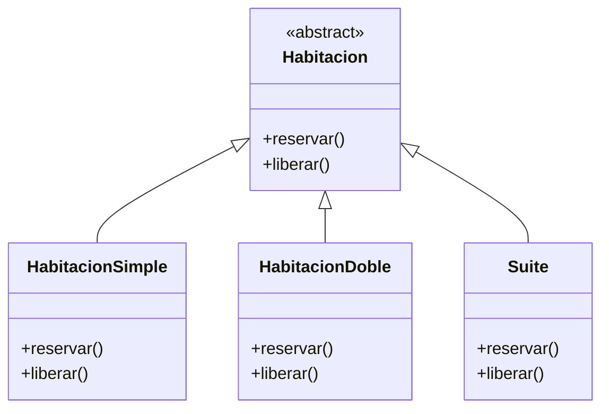
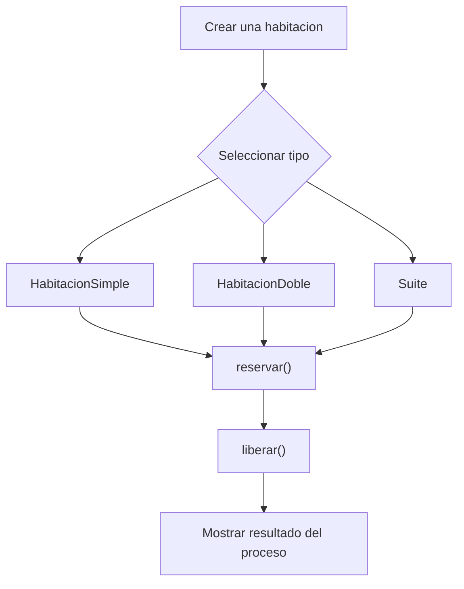

# Caso 16 - Sistema hotelero

## Diagrama UML

## Proceso

## Explicacion

`Habitacion` es una clase abstracta que define el comportamiento comun del sistema mediante los metodos `reservar()` y `liberar()`.

Las clases hijas (`HabitacionSimple`, `HabitacionDoble`, `Suite`) heredan de `Habitacion` y pueden especializar esos metodos para representar habitaciones con capacidad, tarifa y disponibilidad diferentes. Esto aplica el principio de herencia y permite tratar todos los objetos como `Habitacion` sin perder el comportamiento particular de cada tipo.
