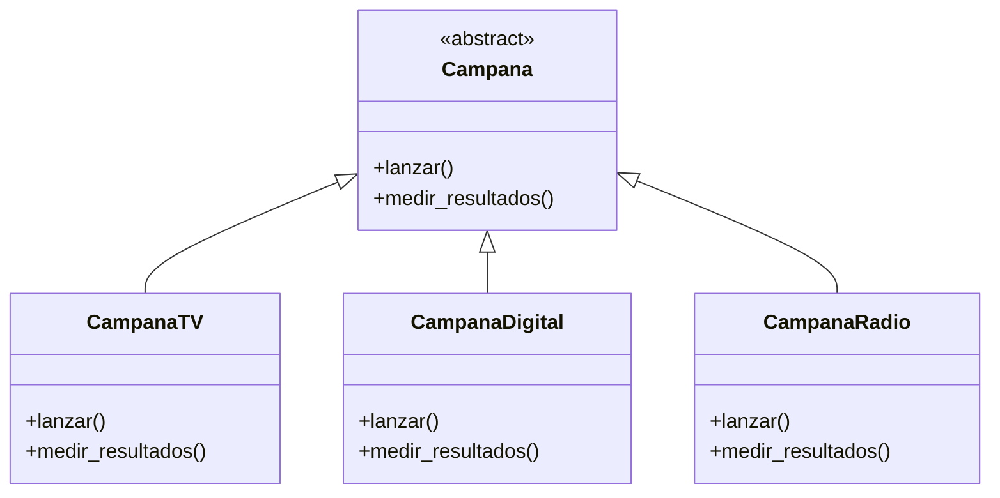
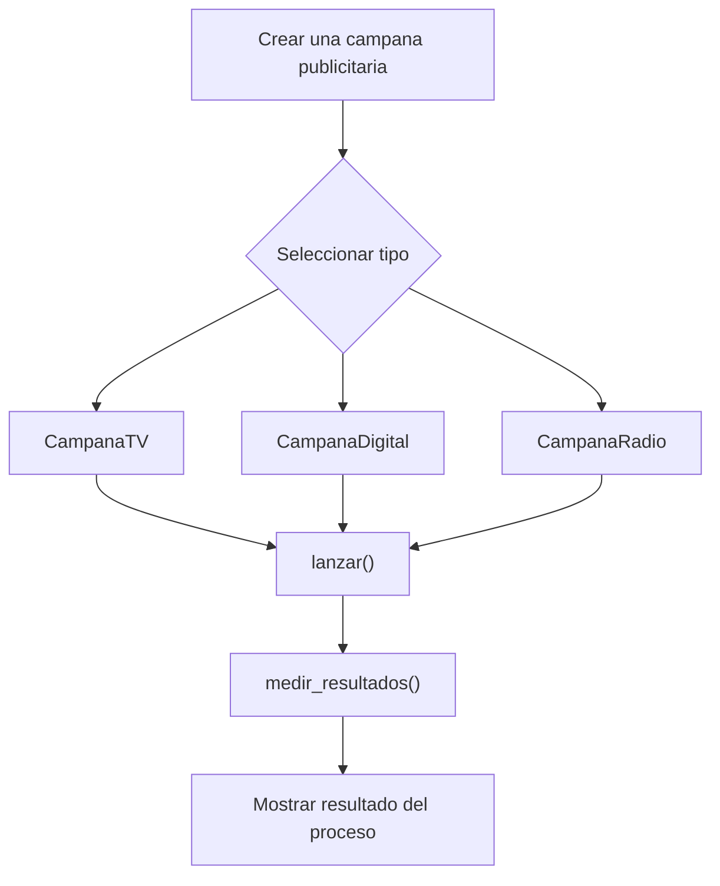

# Caso 17 - Empresa de publicidad

## Diagrama UML

## Proceso

## Explicacion

`Campana` es una clase abstracta que define el comportamiento comun del sistema mediante los metodos `lanzar()` y `medir_resultados()`.

Las clases hijas (`CampanaTV`, `CampanaDigital`, `CampanaRadio`) heredan de `Campana` y pueden especializar esos metodos para representar campanas con medios, alcance y metricas diferentes. Esto aplica el principio de herencia y permite tratar todos los objetos como `Campana` sin perder el comportamiento particular de cada tipo.
