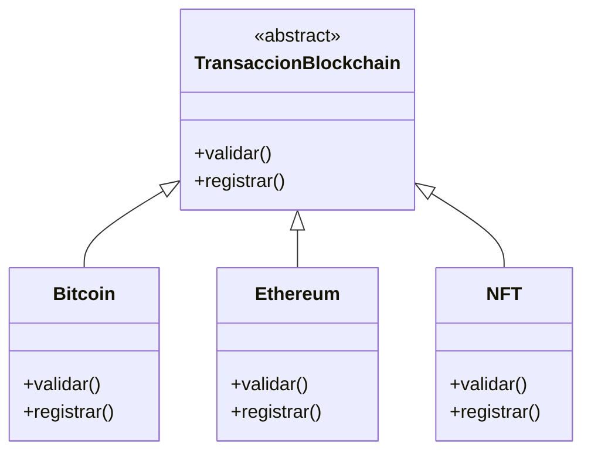
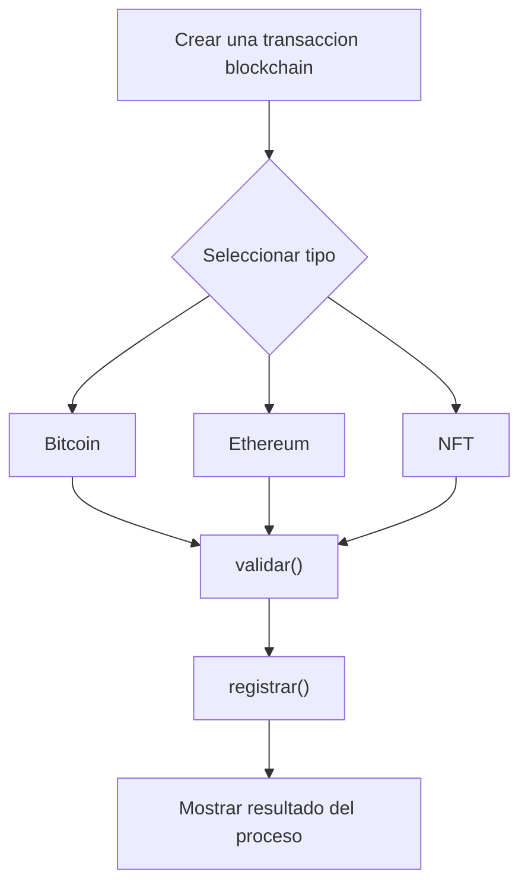

# Caso 18 - Plataforma blockchain

## Diagrama UML

## Proceso

## Explicacion

`TransaccionBlockchain` es una clase abstracta que define el comportamiento comun del sistema mediante los metodos `validar()` y `registrar()`.

Las clases hijas (`Bitcoin`, `Ethereum`, `NFT`) heredan de `TransaccionBlockchain` y pueden especializar esos metodos para representar transacciones con validacion y registro diferentes segun la red. Esto aplica el principio de herencia y permite tratar todos los objetos como `TransaccionBlockchain` sin perder el comportamiento particular de cada tipo.
