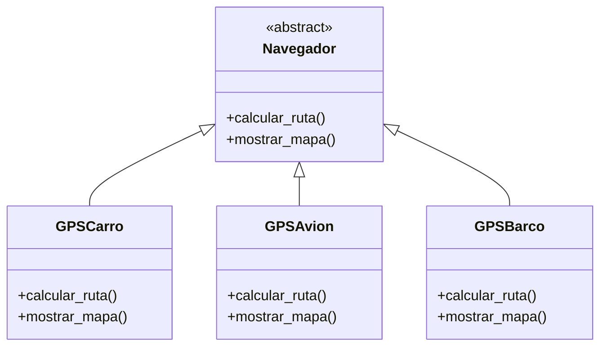
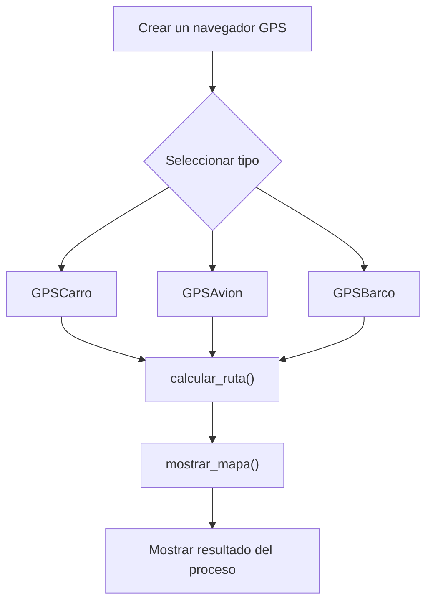

# Caso 19 - Sistema de navegacion

## Diagrama UML

## Proceso

## Explicacion

`Navegador` es una clase abstracta que define el comportamiento comun del sistema mediante los metodos `calcular_ruta()` y `mostrar_mapa()`.

Las clases hijas (`GPSCarro`, `GPSAvion`, `GPSBarco`) heredan de `Navegador` y pueden especializar esos metodos para representar navegadores con rutas y mapas adaptados al medio de transporte. Esto aplica el principio de herencia y permite tratar todos los objetos como `Navegador` sin perder el comportamiento particular de cada tipo.
