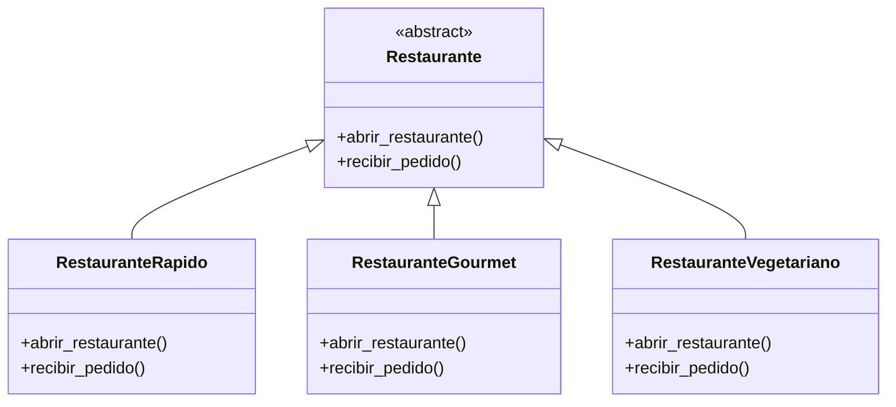
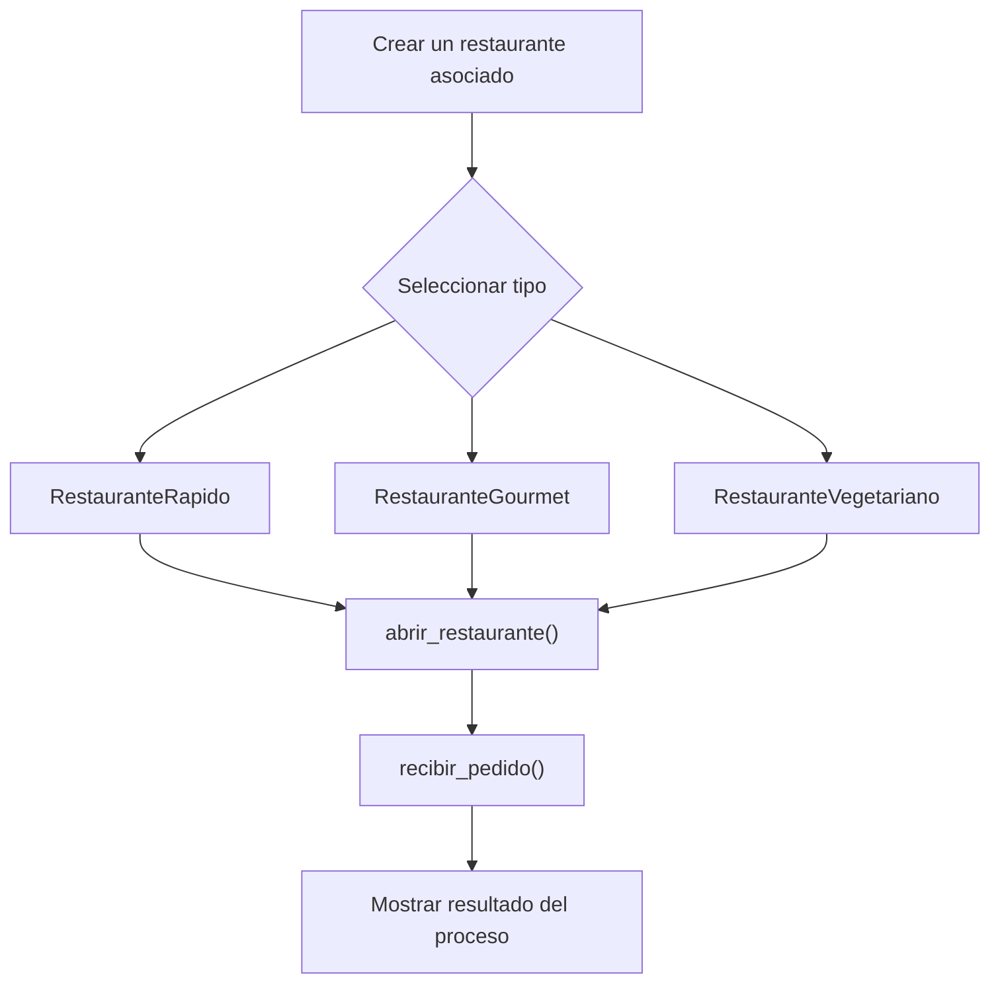

# Caso 2 - Plataforma de delivery de comida

## Diagrama UML

## Proceso

## Explicacion

`Restaurante` es una clase abstracta que define el comportamiento comun del sistema mediante los metodos `abrir_restaurante()` y `recibir_pedido()`.

Las clases hijas (`RestauranteRapido`, `RestauranteGourmet`, `RestauranteVegetariano`) heredan de `Restaurante` y pueden especializar esos metodos para representar restaurantes con modelos de atencion y menus diferentes. Esto aplica el principio de herencia y permite tratar todos los objetos como `Restaurante` sin perder el comportamiento particular de cada tipo.
