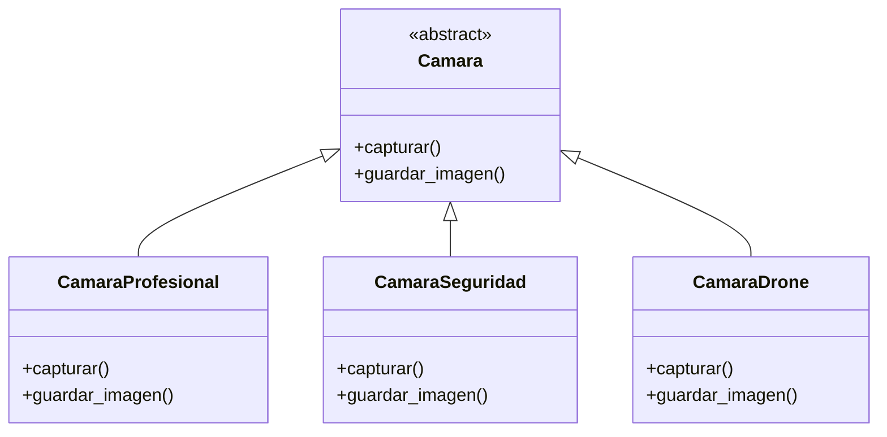
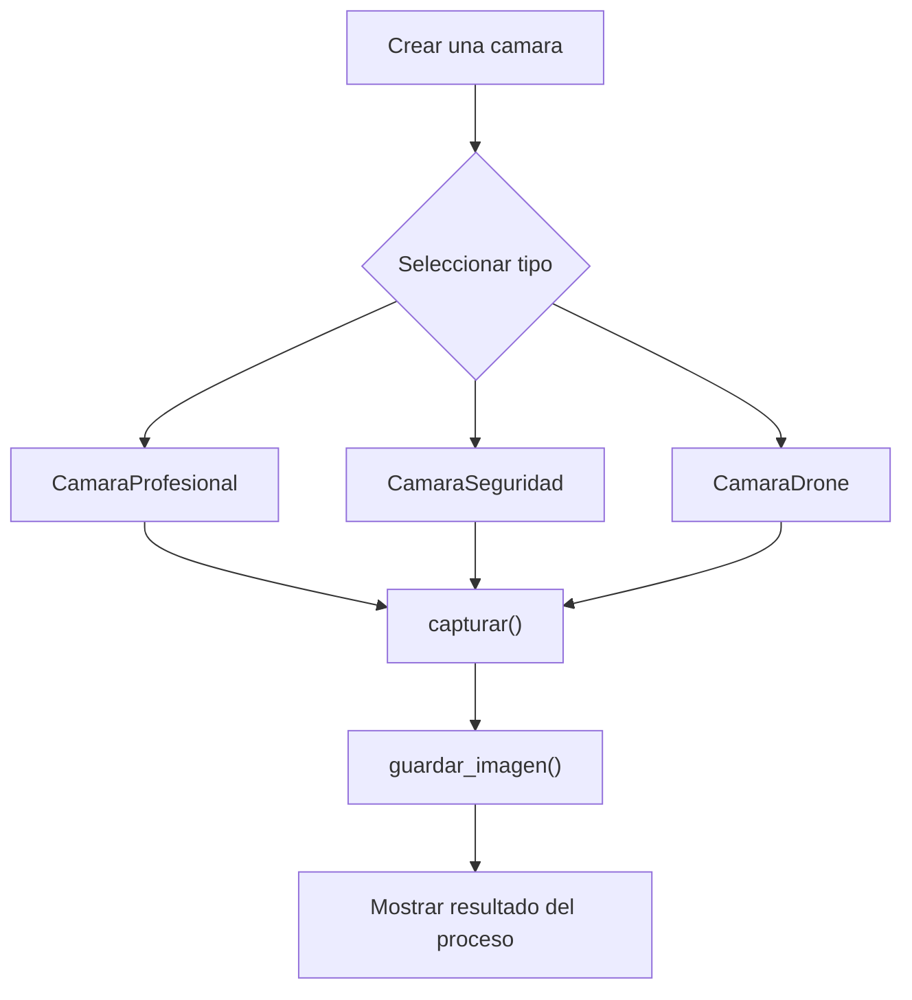

# Caso 20 - Plataforma de fotografia

## Diagrama UML

## Proceso

## Explicacion

`Camara` es una clase abstracta que define el comportamiento comun del sistema mediante los metodos `capturar()` y `guardar_imagen()`.

Las clases hijas (`CamaraProfesional`, `CamaraSeguridad`, `CamaraDrone`) heredan de `Camara` y pueden especializar esos metodos para representar camaras con captura y almacenamiento adaptados al uso. Esto aplica el principio de herencia y permite tratar todos los objetos como `Camara` sin perder el comportamiento particular de cada tipo.
