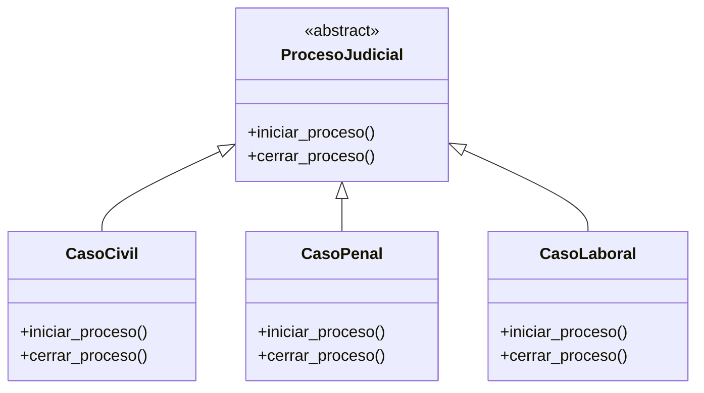
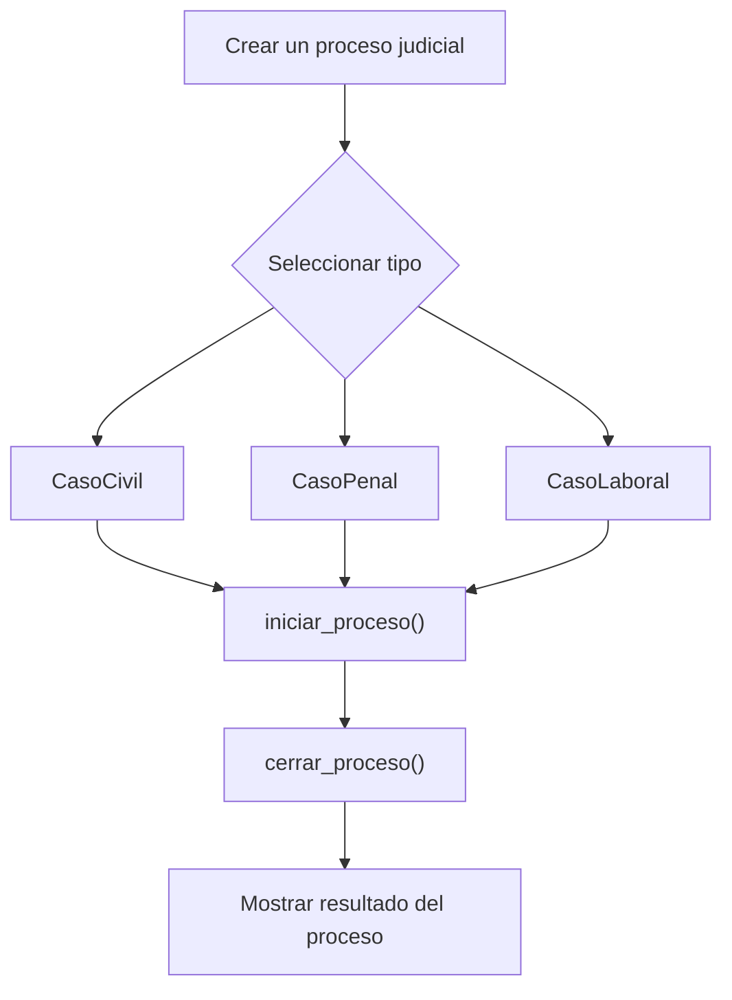

# Caso 21 - Sistema judicial

## Diagrama UML

## Proceso

## Explicacion

`ProcesoJudicial` es una clase abstracta que define el comportamiento comun del sistema mediante los metodos `iniciar_proceso()` y `cerrar_proceso()`.

Las clases hijas (`CasoCivil`, `CasoPenal`, `CasoLaboral`) heredan de `ProcesoJudicial` y pueden especializar esos metodos para representar procesos legales con etapas y cierres diferentes. Esto aplica el principio de herencia y permite tratar todos los objetos como `ProcesoJudicial` sin perder el comportamiento particular de cada tipo.
