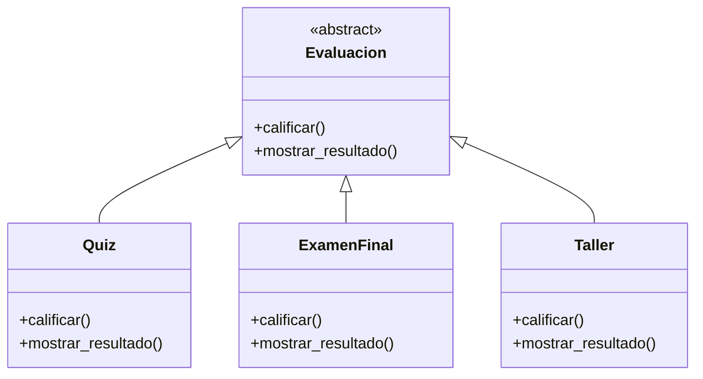
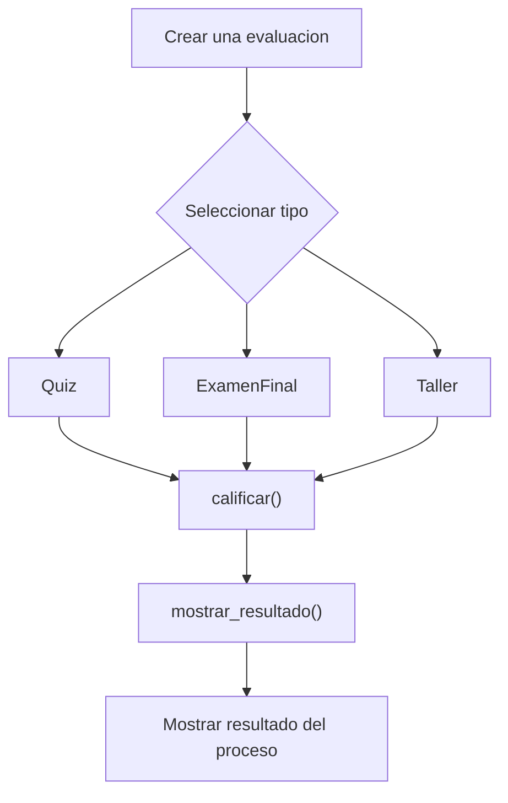

# Caso 22 - Plataforma de aprendizaje

## Diagrama UML

## Proceso

## Explicacion

`Evaluacion` es una clase abstracta que define el comportamiento comun del sistema mediante los metodos `calificar()` y `mostrar_resultado()`.

Las clases hijas (`Quiz`, `ExamenFinal`, `Taller`) heredan de `Evaluacion` y pueden especializar esos metodos para representar evaluaciones con criterios y resultados diferentes. Esto aplica el principio de herencia y permite tratar todos los objetos como `Evaluacion` sin perder el comportamiento particular de cada tipo.
