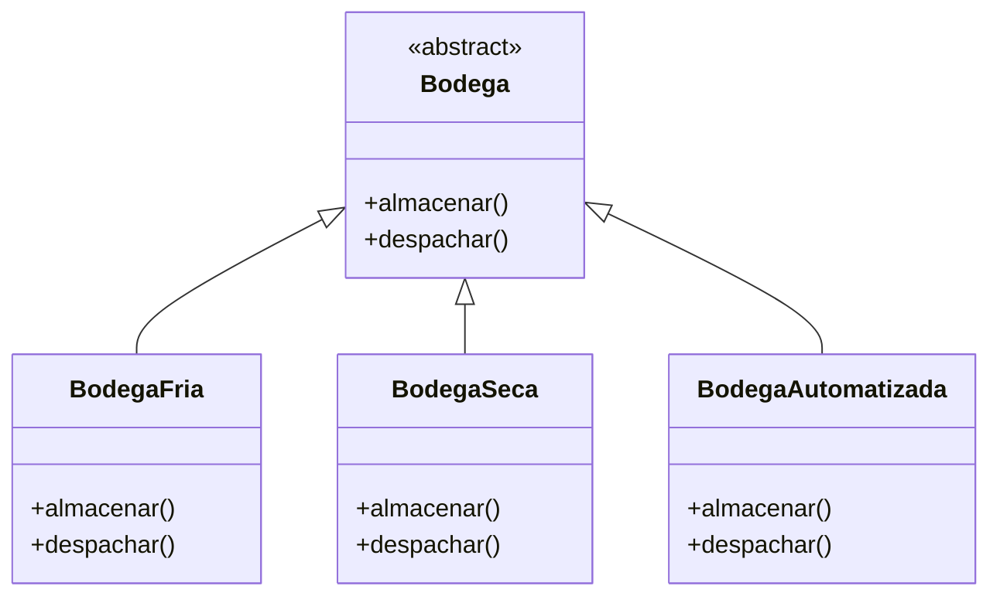
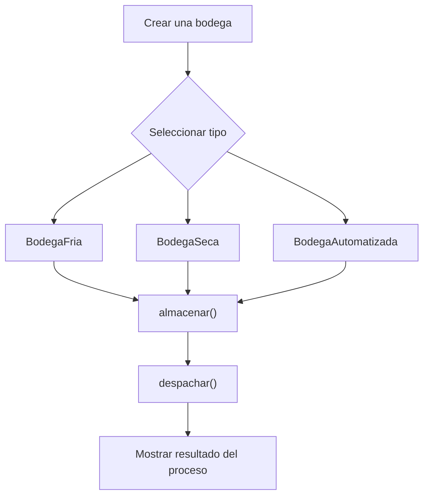

# Caso 23 - Empresa de logistica

## Diagrama UML

## Proceso

## Explicacion

`Bodega` es una clase abstracta que define el comportamiento comun del sistema mediante los metodos `almacenar()` y `despachar()`.

Las clases hijas (`BodegaFria`, `BodegaSeca`, `BodegaAutomatizada`) heredan de `Bodega` y pueden especializar esos metodos para representar bodegas con condiciones de almacenamiento y despacho diferentes. Esto aplica el principio de herencia y permite tratar todos los objetos como `Bodega` sin perder el comportamiento particular de cada tipo.
