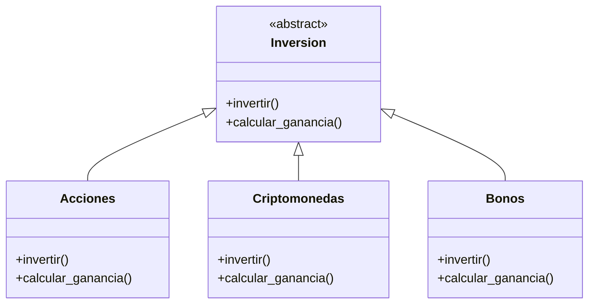
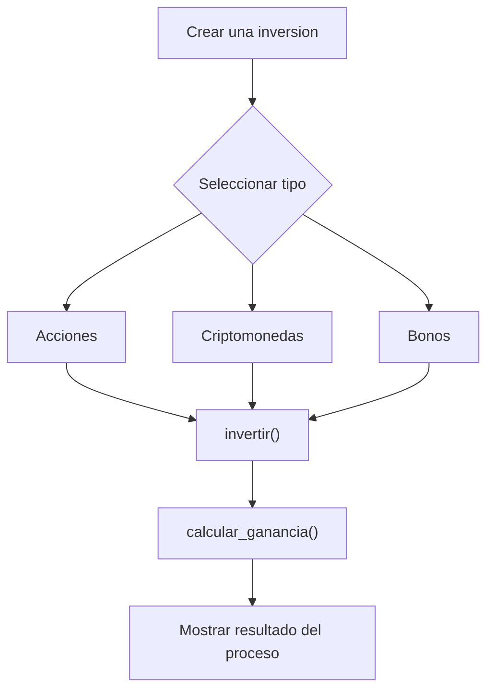

# Caso 24 - Sistema financiero

## Diagrama UML

## Proceso

## Explicacion

`Inversion` es una clase abstracta que define el comportamiento comun del sistema mediante los metodos `invertir()` y `calcular_ganancia()`.

Las clases hijas (`Acciones`, `Criptomonedas`, `Bonos`) heredan de `Inversion` y pueden especializar esos metodos para representar instrumentos financieros con riesgo y ganancia diferentes. Esto aplica el principio de herencia y permite tratar todos los objetos como `Inversion` sin perder el comportamiento particular de cada tipo.
