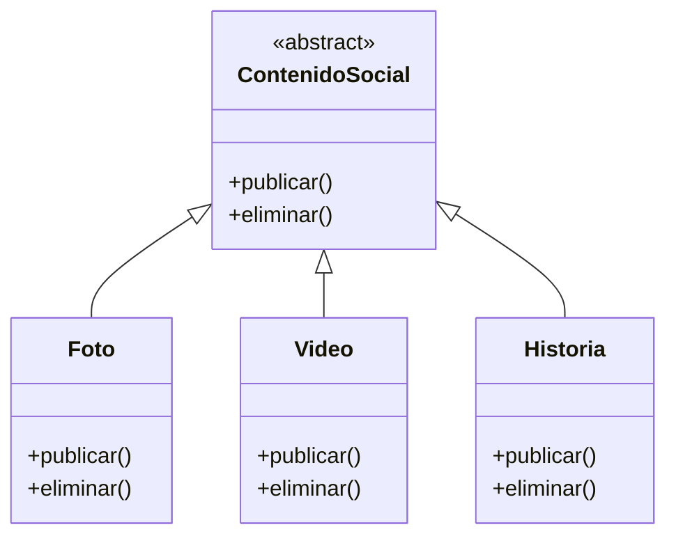
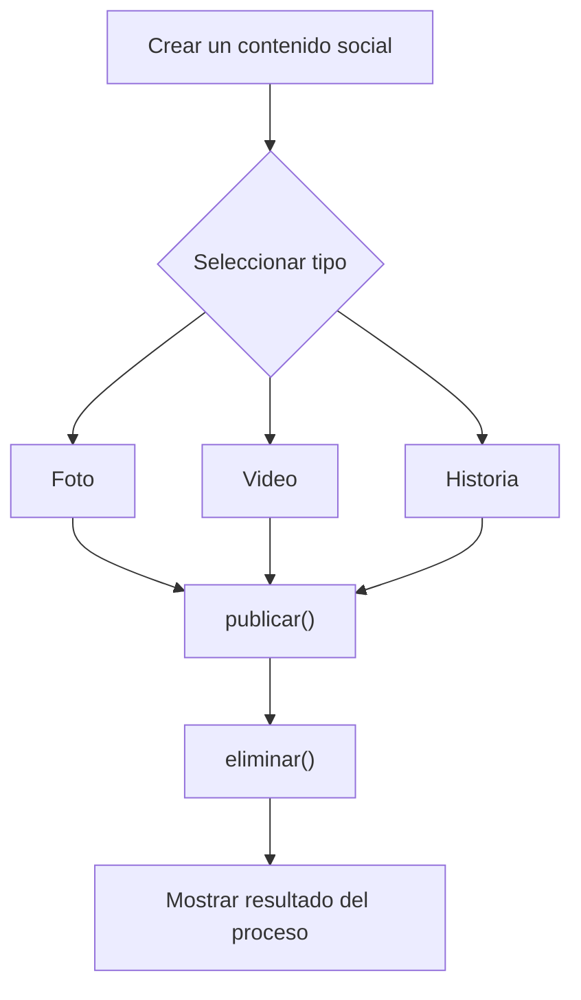

# Caso 25 - Plataforma de redes sociales

## Diagrama UML

## Proceso

## Explicacion

`ContenidoSocial` es una clase abstracta que define el comportamiento comun del sistema mediante los metodos `publicar()` y `eliminar()`.

Las clases hijas (`Foto`, `Video`, `Historia`) heredan de `ContenidoSocial` y pueden especializar esos metodos para representar publicaciones con formatos y permanencia diferentes. Esto aplica el principio de herencia y permite tratar todos los objetos como `ContenidoSocial` sin perder el comportamiento particular de cada tipo.
