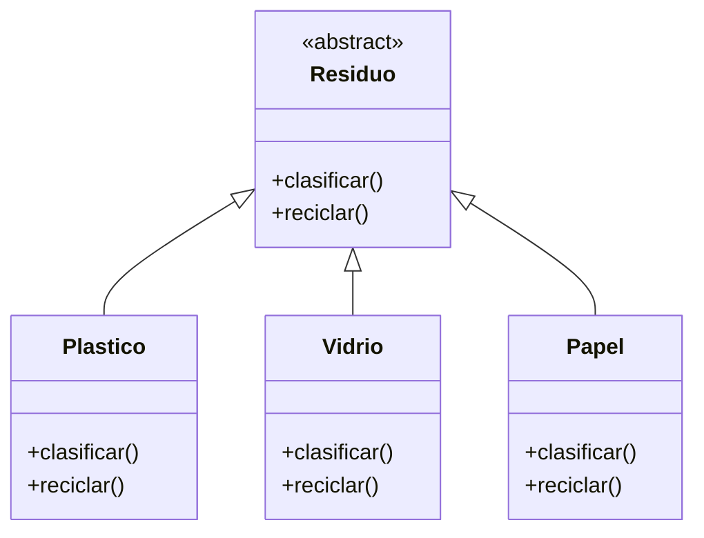
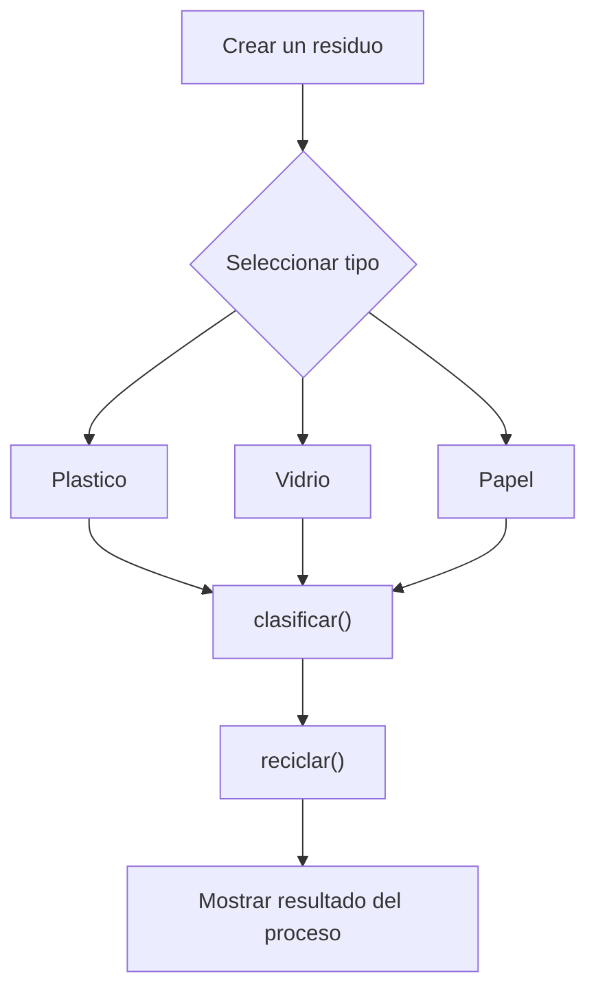

# Caso 26 - Empresa de reciclaje

## Diagrama UML

## Proceso

## Explicacion

`Residuo` es una clase abstracta que define el comportamiento comun del sistema mediante los metodos `clasificar()` y `reciclar()`.

Las clases hijas (`Plastico`, `Vidrio`, `Papel`) heredan de `Residuo` y pueden especializar esos metodos para representar materiales con procesos de clasificacion y reciclaje diferentes. Esto aplica el principio de herencia y permite tratar todos los objetos como `Residuo` sin perder el comportamiento particular de cada tipo.
