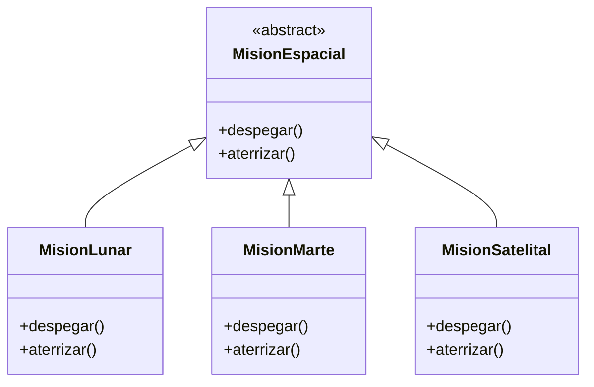
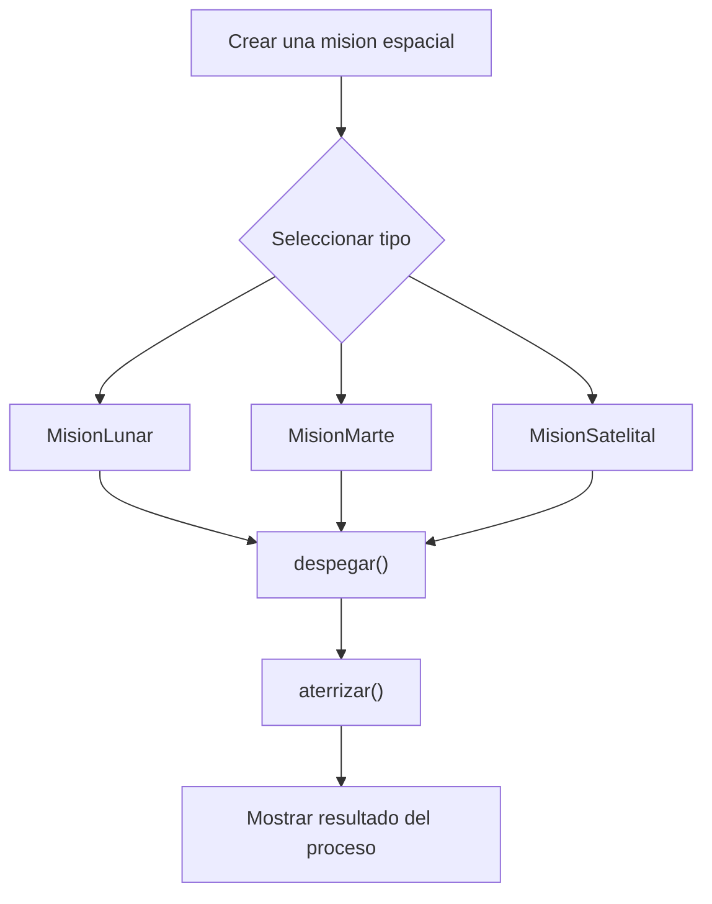

# Caso 27 - Sistema espacial

## Diagrama UML

## Proceso

## Explicacion

`MisionEspacial` es una clase abstracta que define el comportamiento comun del sistema mediante los metodos `despegar()` y `aterrizar()`.

Las clases hijas (`MisionLunar`, `MisionMarte`, `MisionSatelital`) heredan de `MisionEspacial` y pueden especializar esos metodos para representar misiones con objetivos, despegue y aterrizaje diferentes. Esto aplica el principio de herencia y permite tratar todos los objetos como `MisionEspacial` sin perder el comportamiento particular de cada tipo.
