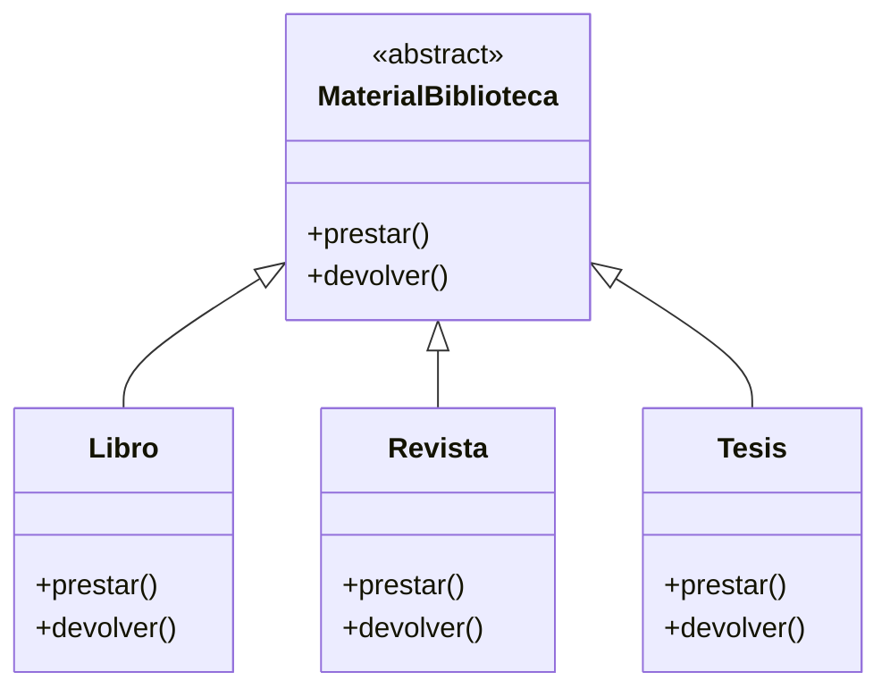
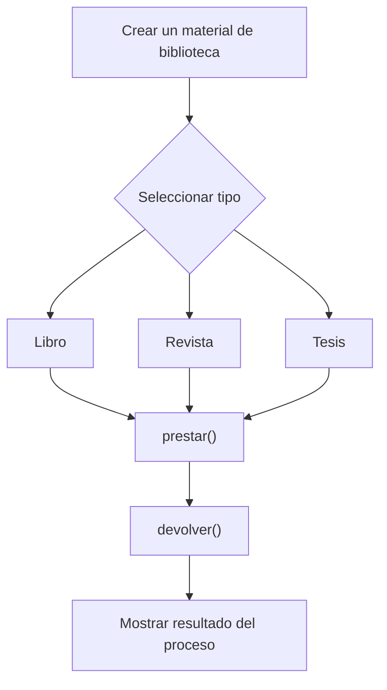

# Caso 3 - Sistema de biblioteca

## Diagrama UML

## Proceso

## Explicacion

`MaterialBiblioteca` es una clase abstracta que define el comportamiento comun del sistema mediante los metodos `prestar()` y `devolver()`.

Las clases hijas (`Libro`, `Revista`, `Tesis`) heredan de `MaterialBiblioteca` y pueden especializar esos metodos para representar materiales con condiciones de prestamo y devolucion diferentes. Esto aplica el principio de herencia y permite tratar todos los objetos como `MaterialBiblioteca` sin perder el comportamiento particular de cada tipo.
