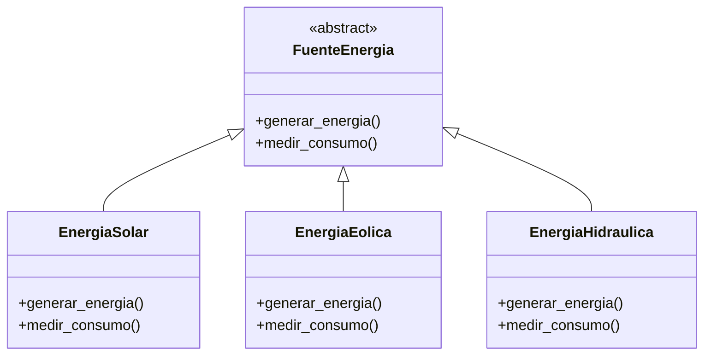
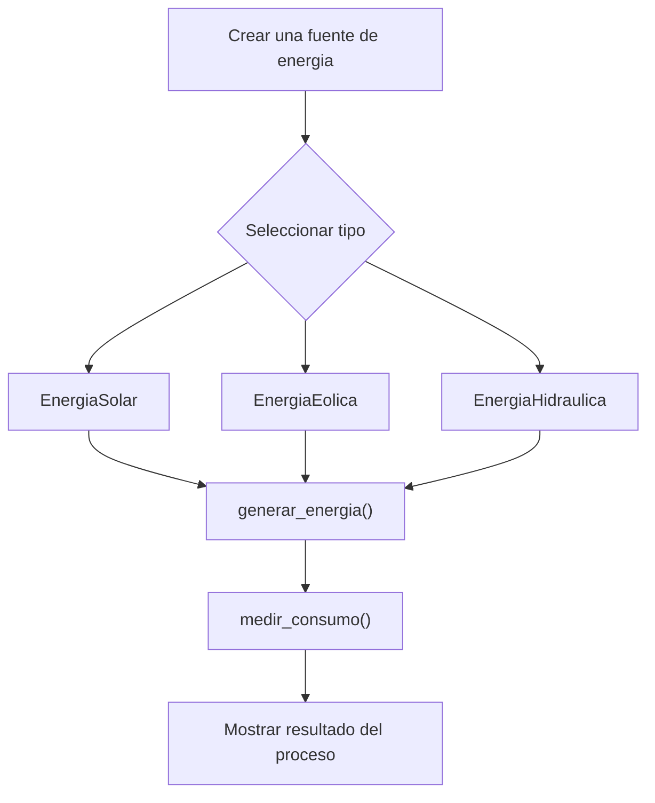

# Caso 4 - Empresa de energia

## Diagrama UML

## Proceso

## Explicacion

`FuenteEnergia` es una clase abstracta que define el comportamiento comun del sistema mediante los metodos `generar_energia()` y `medir_consumo()`.

Las clases hijas (`EnergiaSolar`, `EnergiaEolica`, `EnergiaHidraulica`) heredan de `FuenteEnergia` y pueden especializar esos metodos para representar fuentes energeticas con formas distintas de generacion y medicion. Esto aplica el principio de herencia y permite tratar todos los objetos como `FuenteEnergia` sin perder el comportamiento particular de cada tipo.
