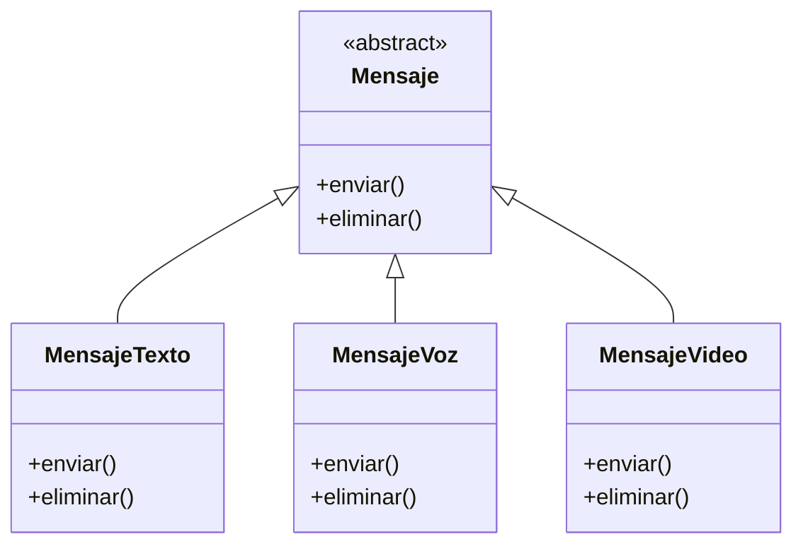
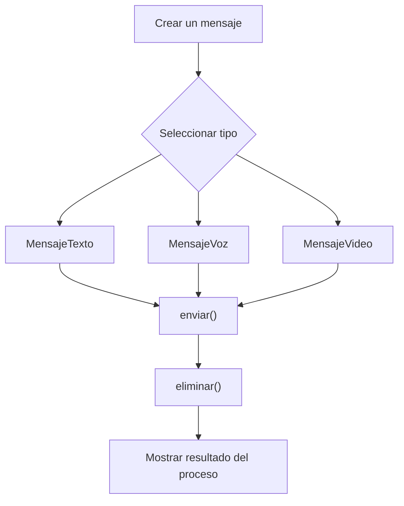

# Caso 5 - Plataforma de mensajeria

## Diagrama UML

## Proceso

## Explicacion

`Mensaje` es una clase abstracta que define el comportamiento comun del sistema mediante los metodos `enviar()` y `eliminar()`.

Las clases hijas (`MensajeTexto`, `MensajeVoz`, `MensajeVideo`) heredan de `Mensaje` y pueden especializar esos metodos para representar mensajes con formatos y comportamientos de envio diferentes. Esto aplica el principio de herencia y permite tratar todos los objetos como `Mensaje` sin perder el comportamiento particular de cada tipo.
