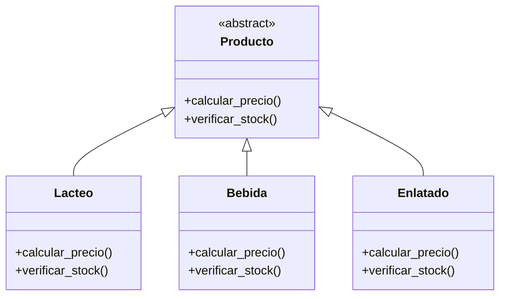
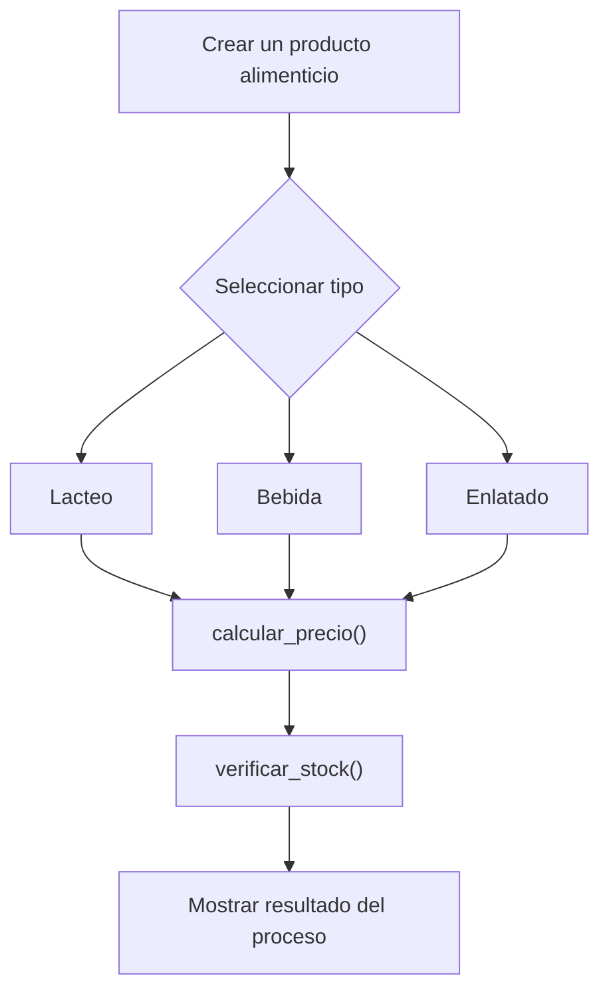

# Caso 6 - Sistema de supermercado

## Diagrama UML

## Proceso

## Explicacion

`Producto` es una clase abstracta que define el comportamiento comun del sistema mediante los metodos `calcular_precio()` y `verificar_stock()`.

Las clases hijas (`Lacteo`, `Bebida`, `Enlatado`) heredan de `Producto` y pueden especializar esos metodos para representar productos con reglas de precio, existencia y manejo diferentes. Esto aplica el principio de herencia y permite tratar todos los objetos como `Producto` sin perder el comportamiento particular de cada tipo.
